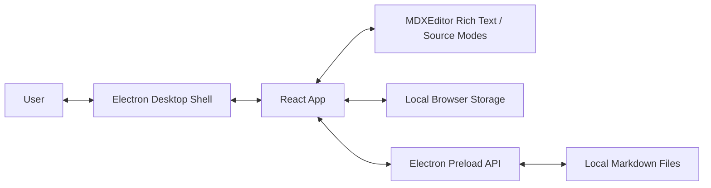

# Architecture Overview

This document serves as a living overview of the Nexus codebase. Update it as the product, file layout, and runtime boundaries evolve.

## Project Structure

- `package.json`: Project scripts, Electron package metadata, and runtime dependencies.
- `electron/main.cjs`: Electron main process that creates the desktop browser window, installs the File menu, handles file dialogs, provides Exit, and loads the built renderer.
- `electron/preload.cjs`: Safe preload bridge exposing menu action subscriptions and Markdown file open/save APIs.
- `index.html`: Vite application entry point.
- `src/main.tsx`: React bootstrap.
- `src/App.tsx`: Primary app shell, document state, local draft persistence, MDXEditor plugin registration, and broad toolbar configuration.
- `src/styles.css`: Global application styling, including the fixed-height editor frame and sticky MDXEditor toolbar layout.
- `src/lib/markdown.ts`: Markdown utilities, default document content, and local storage helpers.
- `scripts/run-electron.ps1`: Windows PowerShell runner that builds the app and launches it through the local Electron dependency.
- `tasks/`: AI-DLC task documents.
- `PRODUCT.md`: Product scope and behavioral requirements.
- `ARCHITECTURE.md`: Architecture and implementation guidance.
- `CHANGELOG.md`: Project change history.

## High-Level System Diagram

Data flow:

1. The user edits Markdown in the React app.
2. The editor updates the in-memory document state.
3. The app persists the draft to local storage.
4. Electron document menu actions are forwarded to the renderer through preload.
5. The renderer requests open/save operations through Electron IPC, and the main process performs file dialogs and disk I/O.
6. The File/Exit menu item quits the Electron application from the main process.

## Technology Used

- Electron: Native desktop shell for running the web app as an application.
- React: UI component model and application state.
- Vite: Local development server and production bundling.
- TypeScript: Static typing for application code.
- MDXEditor: Visual-first Markdown editor.
- Lucide React: UI icons.
- Vitest: Unit test runner for utility behavior.

## Core Components

### Frontend

Name: Nexus Desktop App

Description: The main user interface for editing the current Markdown draft.

Technologies: React, TypeScript, MDXEditor, Vite, CSS.

Deployment: Packaged or launched through Electron. During development, Vite serves the renderer locally.

### Backend Services

N/A. Nexus v1 is local-first and has no backend service.

#### Local Document Workflow

Name: Markdown Document Workflow

Description: Keeps the current Markdown document, MDXEditor plugins and toolbar configuration, and local persistence behavior in one direct UI flow.

Technologies: React state, local storage, MDXEditor toolbar and feature plugins.

Deployment: Runs inside the desktop app renderer.

#### Editor Layout

Name: Sticky Toolbar Editor Frame

Description: Uses CSS to keep the MDXEditor toolbar at the top of the editor frame while the rich-text/source editing region owns the remaining scrollable space.

Technologies: CSS flex layout, sticky positioning, MDXEditor class hooks.

Deployment: Runs inside the desktop app renderer.

## Data Stores

### Browser Local Storage

Name: Nexus Draft Storage

Type: Browser local storage.

Purpose: Stores the current Markdown draft and current file path locally between sessions.

Key Schemas/Collections: `nexus:draft:v1`.

### File System

Name: User Markdown Files

Type: Local files selected through Electron dialogs.

Purpose: Stores documents opened and saved through the native File menu.

Key Schemas/Collections: `.md`, `.markdown`, `.mdx`, and `.txt` files.

## External Integrations / APIs

N/A. Nexus v1 does not call external services.

## Deployment & Infrastructure

Cloud Provider: N/A. Local desktop application.

Key Services Used: Electron runtime.

CI/CD Pipeline: Not configured in the scaffold.

Monitoring & Logging: Browser developer tools during development.

## Security Considerations

Authentication: N/A for v1.

Authorization: N/A for v1.

Data Encryption: N/A for v1 local storage; users should avoid treating local browser storage as encrypted.

Key Security Tools/Practices:

- Keep document content local by default.
- Do not send content to remote AI services in v1.
- Prefer explicit user actions for open and save.
- Keep Node integration disabled in the renderer and expose file actions through preload IPC only.

## Development & Testing Environment

Local Setup Instructions:

1. Run `npm install`.
2. Run `npm run dev` for the Vite development server.
3. Run `npm run build` to create a production bundle.
4. Run `powershell -ExecutionPolicy Bypass -File scripts/run-electron.ps1` to build and launch with Electron.
5. Run `powershell -ExecutionPolicy Bypass -File scripts/run-electron.ps1 -SkipBuild` to launch the existing build.

Testing Frameworks: Vitest for utility tests.

Code Quality Tools: TypeScript compiler.

## Future Considerations / Roadmap

- Add unsaved-change prompts before replacing or closing modified documents.
- Add real AI provider integrations behind explicit settings and privacy warnings.
- Add changed-lines review and accept/reject controls for individual changed blocks.
- Add Git-aware diff support for repository-backed Markdown files.
- Add packaging scripts for distributable desktop builds.

## Glossary / Acronyms

AI: Artificial Intelligence.

AI-DLC: AI Development Lifecycle.

MDX: Markdown with JSX.

Electron: Desktop application runtime that combines Chromium and Node.js.
