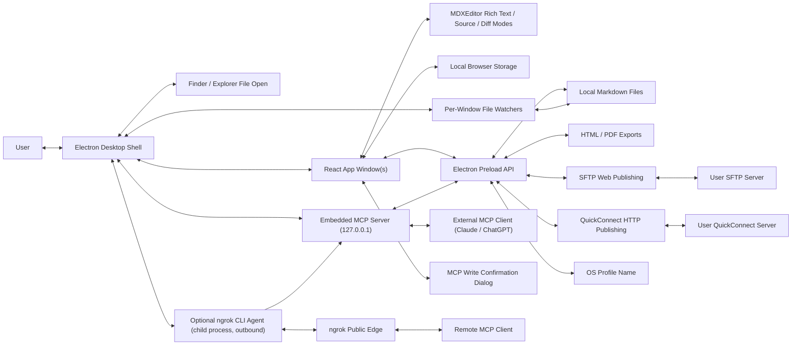

# Architecture Overview

This document serves as a living overview of the Nexus codebase. Update it as the product, file layout, and runtime boundaries evolve.

## Project Structure

- `package.json`: Project scripts, Electron package metadata, Windows and macOS icon packaging metadata, Markdown export dependency metadata, the `ssh2-sftp-client` SFTP publishing dependency, bundled Fontsource font dependencies, and runtime dependencies. Nexus does not bundle an ngrok library; the optional MCP tunnel uses the user's externally-installed ngrok CLI.
- `.github/workflows/build-desktop.yml`: GitHub Actions workflow that builds and uploads Windows and macOS desktop artifacts on `develop` pushes and manual runs.
- `electron/main.cjs`: Electron main process that creates one or more desktop browser windows, applies the local app icon, installs the File, Edit, View, Settings, and Help menus, handles file dialogs and unsaved-change prompts, forwards editor zoom menu actions, displays the current editor zoom percentage in the View menu, exports Markdown to self-contained HTML and paper-sized PDF with local image resolution, selected editor font, selected base font size, selected orientation, selected margins, and Mermaid diagram rendering, publishes the self-contained HTML rendering to a user-specified SFTP server with per-publish credentials and host-key confirmation, pushes the same self-contained HTML to a user-configured HTTP endpoint over QuickConnect with a bearer token, resolves local image preview paths, watches opened files for external changes, accepts OS file-open handoffs, maintains a persisted recent-files list behind the File/Open Recent menu (mirrored to the OS recent documents), guards close attempts per window, coordinates application quit across multiple dirty windows, exposes the OS profile name, provides Exit, owns the native editable context menu with spellcheck suggestions, hosts the optional embedded MCP server lifecycle, persists the MCP bearer token encrypted at rest with `safeStorage` (the `mcp:get-bearer-token`/`mcp:set-bearer-token` IPC handlers keep a per-profile ciphertext map in `mcp-bearer-tokens.json` under userData, mirroring the QuickConnect token store), manages the optional ngrok tunnel that forwards to the loopback MCP port, serves the cache-backed MCP read tool calls (list windows, get document, get outline, get section, search document, find) from the per-window MCP record, routes the MCP selection read tool through a renderer request/response round trip, computes the in-buffer MCP write tools (apply edits, replace section, set frontmatter) into a proposed buffer and routes every write — full replacement and granular edits — through the renderer confirmation dialog (or applies it directly when the profile's auto-approve-writes setting is on), answers the MCP "test connection" request by probing the server's `/health` endpoint locally and over the ngrok URL when connected, handles explicit stop/restart requests for the ngrok tunnel agent, and loads the built renderer.
- `electron/preload.cjs`: Safe preload bridge exposing menu action subscriptions, open-recent-file subscriptions and the recent-file open request, initial OS-opened file lookup, close-request coordination, profile-name lookup, Markdown file open/save/watch/export APIs (HTML and PDF), paper-size, orientation, and margin PDF export options, the SFTP publish request and host-key-decision reporting bridge, the QuickConnect HTTP publish request, a private-key file picker, image selection and preview-resolution APIs, external file change subscriptions, the unsaved-change confirmation dialog, MCP server configure/get-state/regenerate-token requests, the encrypted MCP bearer token get/set requests, the MCP connection test request, the ngrok stop/restart requests, MCP renderer registration, MCP read/write tool dispatch from main, the MCP selection request subscription and selection-result reporting, and MCP write-confirmation result reporting.
- `electron/mcp-server.cjs`: Embedded Model Context Protocol server. Owns the `http.Server` bound to `127.0.0.1` on the configured port, implements the Streamable HTTP transport at `POST /mcp` with JSON-RPC framing, validates the bearer token, dispatches to the read-only tools (`nexus_list_windows`, `nexus_get_document`, `nexus_get_outline`, `nexus_get_section`, `nexus_search_document`, `nexus_find`, `nexus_get_selection`) and the write tools (`nexus_replace_document`, `nexus_apply_edits`, `nexus_replace_section`, `nexus_set_frontmatter`), and exposes start/stop/reconfigure hooks used by `electron/main.cjs`. The tool implementations delegate to host callbacks supplied by the main process; the write tools and the selection read tool ask the target renderer (to confirm/apply a change, or to report the live selection) before resolving, and an edit that cannot be located is returned as an `isError` result without a dialog. It also serves an authenticated `GET /health` verification endpoint (same loopback bind and bearer check as `/mcp`, returning server identity) and exposes `testConnection({ ngrokUrl })`, which probes that endpoint over loopback and, when a public URL is supplied, over the tunnel — used by the Preferences "Test setup" button. It additionally serves a static, unauthenticated landing page at `GET /` so the server URL (local or public) can be opened in a browser to confirm reachability; the page exposes no document content or tools. In bearer mode it also hosts the OAuth 2.1 surface for MCP clients that require the MCP authorization spec (ChatGPT custom connectors, Claude.ai): 401 responses carry an RFC 9728 `WWW-Authenticate` challenge, the well-known protected-resource/authorization-server metadata endpoints, `POST /register`, `GET /authorize` (a consent page), `POST /authorize/decision`, and `POST /token` route into `electron/mcpOauth.cjs`, with origins derived from the Host header plus ngrok's `X-Forwarded-Proto` so discovery works both on loopback and through the tunnel.
- `electron/mcpOauth.cjs`: Minimal OAuth 2.1 authorization-server logic for the MCP server (no Electron or HTTP dependencies). RFC 9728/8414 metadata builders, RFC 7591 dynamic client registration with https-or-loopback redirect-URI validation and best-effort persistence to a per-machine JSON file (`mcp-oauth-clients.json` under userData — client ids and redirect URIs only, no secrets), consent-gated authorization requests (10-minute TTL, CSRF nonce bound to the served consent page), single-use 5-minute authorization codes, and a PKCE-S256-only token exchange that issues the server's existing static bearer token as the access token — so `/mcp` validation is unchanged, OAuth-issued access survives restarts, and regenerating the token revokes every client. Pending requests and codes are in-memory and cleared on server disable/stop. Exercised end to end by `electron/mcpServer.oauth.test.ts`.
- `electron/ngrok-tunnel.cjs`: Small main-process module that manages the optional MCP tunnel by spawning the user's installed ngrok CLI as a child process (`ngrok http <port> [--domain <domain>] --log stdout --log-format json`, no shell). It reads the agent's JSON log lines from stdout and resolves the public URL from the `started tunnel` line, treats a spawn `ENOENT` as "ngrok CLI not found", and surfaces authtoken/start errors (error-level log lines) with a pointer to `ngrok config add-authtoken`. On macOS it prepends the standard Homebrew bin locations (`/opt/homebrew/bin`, `/usr/local/bin`) to `PATH` before spawning, because a Finder/Dock-launched app does not inherit the shell `PATH` and would otherwise not find a Homebrew-installed ngrok. Exposes `ensureTunnel({ port, domain, command })` (starts or restarts the agent using `command` as the executable — `"ngrok"` from PATH by default, or an explicit user-configured path — binding the optional reserved/custom `domain` when supplied and falling back to a random URL when the domain cannot be bound), `stopTunnel()` (kills the agent through the serialized queue), `killTunnelSync()` (a synchronous, idempotent kill used by the app's `will-quit` and `process.on("exit")` handlers so the non-detached agent cannot outlive a graceful quit; a hard kill/crash runs no JS and is out of scope), and `getTunnelState()` (returns `{ connected, url, error, domainFallback }`). It respawns when the command, port, or domain changes. Tracks the active port and domain and respawns when either changes, serializes calls, kills the agent on stop and on app quit, and reflects an unexpected agent exit as a disconnected tunnel. The ngrok authtoken is read from the ngrok CLI's own configuration and is never stored by Nexus.
- `electron/recentFiles.cjs`: Pure CommonJS helper for the recent-files list shared by the main process. Exposes `sanitizeRecentFiles`, `addRecentFile`, `removeRecentFile`, and a `defaultComparePath` (case-insensitive on Windows) plus the `DEFAULT_RECENT_FILES_LIMIT`; every function returns a new, deduped, capped, most-recent-first list without mutating its input, keeping the ordering logic unit-testable apart from Electron. Covered by `electron/recentFiles.test.ts`.
- `electron/mcpDocumentTools.cjs`: Pure CommonJS logic for the cache-served MCP read tools. Exposes `buildDocumentOutline` (ATX heading tree mirroring `src/lib/outline.ts` but with 1-based lines and deduped slugs from `headingSlugger.cjs`), `getDocumentSection` (slice a section by heading index/slug/text through the next same-or-higher heading), `searchDocument` (literal/regex search with 1-based positions, accurate total, and a capped result list), `findInDocument` (the same search grouped by line, each match carrying surrounding context lines and the enclosing heading for comprehension), and the shared `getSectionRange` / `parseHeadings` helpers reused by the write edits module. No Electron dependencies, so it runs against the main-process MCP record's cached Markdown and is unit-tested by `src/lib/mcpDocumentTools.test.ts` (parity-checked against `extractOutline`).
- `electron/mcpDocumentEdits.cjs`: Pure CommonJS logic for the in-buffer MCP write tools. Exposes `applyEdits` (ordered literal/regex find-replace that fails the batch on a missing or ambiguous anchor), `replaceSection` (swap a section's lines using `getSectionRange` from `mcpDocumentTools.cjs`), and `setFrontmatter` (set/merge/remove scalar YAML fields, refusing non-scalar blocks). Each returns `{ ok: true, markdown }` (a proposed full buffer) or `{ ok: false, reason, ... }`; the main process turns a success into a confirmation request and a failure into a tool error. Unit-tested by `src/lib/mcpDocumentEdits.test.ts`.
- `index.html`: Vite application entry point.
- `src/main.tsx`: React bootstrap and bundled Fontsource font stylesheet imports for editor rendering.
- `src/App.tsx`: Primary app shell, document state, blank startup behavior, initial empty-editor focus, application title formatting, font, paragraph spacing, paper-size, paper-orientation, margin, editor zoom state, light/dark/system theme resolution, paper/plain editor view state, plain-view responsive wrapping state, MDXEditor plugin registration, image preview handling, toolbar registration, rich/source scroll-position synchronization, find-panel command routing, outline sidebar visibility state and heading-to-section scrolling, source-mode "Clean up formatting" routing (rewriting the CodeMirror buffer in place), Publish as Web dialog routing and host-key confirmation handling, QuickConnect publish dialog routing, and diff baseline coordination.
- `src/components/about/AboutDialog.tsx`: Shadcn-styled About dialog opened from the Help menu.
- `src/components/editor/CleanUpFormatting.tsx`: Source-mode-only toolbar button (lucide `Brush`) that triggers the "Clean up formatting" command, mirroring the `InsertTableOfContents` button shape.
- `src/components/editor/EditorContextMenu.tsx`: Browser-fallback editor context menu that exposes Cut, Copy, and Paste using local shadcn-style primitives when the app is not running inside Electron.
- `src/components/editor/FileChangedDialog.tsx`: Shadcn-styled external file change and conflict prompt.
- `src/components/editor/FindTextPanel.tsx`: Compact in-editor find-and-replace panel backed by MDXEditor's search plugin, with literal text search, match counts, next/previous navigation, active-match scroll callbacks, a collapsible replace row offering replace-current and replace-all (literal replacement text), and close behavior.
- `src/components/editor/InsertImageImport.tsx`: Shadcn-styled image import dialog and toolbar button for local file URL, remote HTTP(S), and embedded base64 image insertion.
- `src/components/editor/OutlineSidebar.tsx`: Shadcn-styled collapsible outline panel that lists the current document's headings as a depth-indented, clickable tree, reports the selected heading so the app shell can scroll the editor to it, highlights the active (scroll-spy) entry passed down by the app shell, and keeps that entry scrolled into view within its own list.
- `src/components/editor/ListExitPlugin.ts`: Small MDXEditor/Lexical plugin that restores normal desktop list exit behavior when Enter is pressed on an empty list item.
- `src/components/editor/ShadcnMdxToolbar.tsx`: Project-owned shadcn-styled grouped toolbar composition that keeps MDXEditor's broad rich-text command set visible in unlabeled button groups, applies consistent tooltips to Nexus-owned controls, includes paper/plain, paper orientation, plain-view responsive wrapping, and outline sidebar toggles, floats the view-control group in source and diff modes (adding the "Clean up formatting" button to that floating cluster only in source mode), and leaves undo, redo, refresh, zoom, and document actions in native menus.
- `src/components/ui/button-group.tsx`: Local shadcn-style button group primitive used to cluster related toolbar controls without visible group labels.
- `src/components/settings/SettingsDialog.tsx`: Shadcn-styled settings dialog for editor appearance, light/dark/system theme, unit-labeled base font size, paragraph spacing, paper-size, paper-orientation, margin preferences, and the optional MCP server enable/port/auth-mode/bearer-token section, including the ngrok tunnel toggle, optional custom-domain field, connected public URL and public `/mcp` endpoint URL with copy controls, the tunnel error and domain-fallback notices, ngrok CLI / `ngrok config add-authtoken` setup guidance, and the no-authentication exposure warning.
- `src/components/mcp/McpWriteConfirmDialog.tsx`: Shadcn-styled confirmation modal that renders the proposed Markdown alongside the current buffer when an MCP client invokes the document replace tool, with Approve and Reject actions resolving the pending tool call.
- `src/components/publish/PublishWebDialog.tsx`: Shadcn-styled Publish as Web dialog that collects SFTP connection details (host, port, username, password or private-key file path with passphrase, remote directory, remote filename, optional public base URL), shows the server host-key fingerprint for confirmation before upload, reports progress and errors, and shows the resulting page URL with a copy control on success. Secret fields are kept in component state only and sent transiently to the main process.
- `src/components/publish/QuickConnectDialog.tsx`: Shadcn-styled QuickConnect dialog that collects the HTTP endpoint URL, path, and bearer token (all pre-filled from saved per-profile settings), reports progress and errors, and shows the resulting page URL with a copy control when the server returns one. Simpler than the SFTP dialog: no host/port/username/auth-method or host-key step.
- `src/components/ui/`: Local shadcn-style UI primitives used by project-owned controls.
- `src/styles.css`: Global application styling, including light and dark app theme tokens, the toggleable paper/plain rich-text editing surface, toolbar-matched rich/source/diff editor backgrounds, edge-to-edge editor frame, sticky white shadcn-styled grouped toolbar layout with a gray bottom border, floating source/diff view controls, bordered paragraph dropdown controls, raised transform-offset dropdown and tooltip layers, the collapsible outline sidebar layout, and the shared Publish as Web / QuickConnect dialog layout.
- `src/lib/utils.ts`: Shared class name utility for shadcn-style components.
- `src/lib/markdown.ts`: Markdown utilities, default document content, local storage helpers, and line-ending-normalized dirty comparison helpers.
- `src/lib/outline.ts`: Extracts the document outline (heading level, text, ordinal position, and source line index) from the current Markdown buffer for the outline sidebar, ignoring headings inside fenced code blocks. Also exposes `getActiveHeadingIndex`, the pure scroll-spy helper that picks the active heading from each heading's content-top offset and the current scroll viewport (with bottom-edge and above-first-heading handling).
- `src/lib/format.ts`: Pure `cleanupMarkdownFormatting(markdown)` used by the source-mode "Clean up formatting" command. Normalizes list markers and spacing, blank lines around ATX headings, GFM table alignment, thematic breaks, blank-line runs, and trailing whitespace, while passing fenced code blocks and a leading YAML frontmatter block through verbatim. Idempotent and non-lossy (regex/line based, no MDXEditor round-trip). Covered by `src/lib/format.test.ts`.
- `src/lib/demoDocument.ts`: Built-in Markdown feature showcase used by the File/Load Demo Document action for demos and export smoke tests.
- `src/lib/settings.ts`: Local settings utilities, default editor font, bundled web font options, base font size, paragraph spacing, light/dark/system theme preference, paper/plain view, plain-view responsive wrapping, outline sidebar visibility, paper-size, paper-orientation, margin configuration, MCP server enabled/port/auth-mode/bearer-token defaults and sanitizers plus the ngrok tunnel enabled flag, optional custom domain, and optional custom executable path (no ngrok authtoken is stored; the ngrok CLI supplies it), non-secret SFTP publish target defaults and sanitizers (host, port, username, remote directory, optional public base URL; never secrets), QuickConnect target defaults and sanitizers (url, path, and bearer token; the token is persisted here by explicit user choice), and OS-profile-scoped storage keys.
- `scripts/run-electron.ps1`: Windows PowerShell runner that builds the app and launches it through the local Electron dependency.
- `scripts/generate-mac-icon.mjs`: Cross-platform Node script that converts the root `nexus.png` asset into a packaged macOS `nexus.icns` bundle icon.
- `tasks/`: AI-DLC task documents.
- `PRODUCT.md`: Product scope and behavioral requirements.
- `ARCHITECTURE.md`: Architecture and implementation guidance.
- `CHANGELOG.md`: Project change history.

## High-Level System Diagram

Data flow:

1. The user edits Markdown in one or more React app windows.
2. On launch, the renderer initializes a blank untitled document with no current file path.
3. The Electron main process applies `nexus.png` to each BrowserWindow and to the macOS Dock when available.
4. The editor updates the in-memory document state.
5. File/New Window creates another BrowserWindow with its own renderer state and a blank untitled document.
6. macOS Finder `open-file` events and Windows Explorer/Open With process arguments are normalized into file paths.
7. OS-handed file paths create editor windows with pending initial file payloads.
8. The renderer asks preload for its initial opened file and loads it into that window's independent document state.
9. When startup confirms there is no initial opened file and the document is still an empty untitled buffer, the renderer focuses MDXEditor at the root start once so the user can type immediately.
10. Electron document menu actions are forwarded to the focused renderer window through preload.
11. The renderer requests open/save operations through Electron IPC, and the main process performs file dialogs and disk I/O for the window that made the request.
12. For File/New, the focused renderer compares the current editor buffer against the last saved/opened buffer using a line-ending-normalized dirty check and asks the main process to show a Save, Don't Save, or Cancel prompt before clearing dirty content.
13. For File/Open, the focused renderer first asks the main process to show the native open-file dialog; only after a file is selected does it compare the current buffer against the last saved/opened buffer using the same line-ending-normalized dirty check and ask whether to save, discard, or cancel before replacing dirty content.
14. For File/Load Demo Document, the focused renderer asks the same dirty-buffer confirmation helper before replacing the current buffer with the built-in feature showcase as a clean untitled document.
15. For File/Export as HTML and File/Export as PDF, the focused renderer sends its current Markdown buffer, current file path, selected editor font, selected base font size, and selected paragraph spacing to Electron without changing saved state. PDF export also sends the selected Letter or A4 paper size, portrait/landscape orientation, and page margins.
16. The Electron main process renders export HTML with Marked, resolves Markdown image paths with the same local path rules used by preview, converts supported admonition directives into styled callout HTML, and emits Mermaid placeholders for fenced `mermaid` code blocks. HTML export uses a self-contained path: prompt for the destination, inline supported local Markdown images as base64 data URLs, inline selected bundled Fontsource CSS and font files as base64 data URLs, load the document from a temporary file for Mermaid rendering, replace successful Mermaid placeholders with base64 SVG image data URLs, and write the static HTML file. PDF output keeps the pre-print-preview direct flow: strip leading YAML frontmatter, load the rendered HTML as a data URL, render Mermaid diagrams in that export window, wait for fonts, call Electron's PDF renderer once with selected page size, orientation, custom margins, and print backgrounds, then write the resulting bytes after a save dialog. If direct rich PDF generation fails, the export reports that error instead of writing a plain text fallback PDF.
17. Each renderer formats its own native window title from its current file path and dirty state, using the app name first and falling back to Untitled when no file path is active.
18. Window close attempts are paused per window while that renderer decides whether dirty content should be saved, discarded, or kept open.
19. Application quit requests walk through all open windows, prompting each dirty renderer before closing it; canceling any prompt stops the quit flow.
20. The renderer resolves the close request back to the main process; accepted requests close the window and canceled requests leave the window running.
21. Electron handles editable `webContents` context-menu events in the main process and opens a native menu with spelling suggestions, Add to dictionary, Cut, Copy, and Paste.
22. The native context menu calls Electron's misspelling replacement, spellchecker dictionary, and edit-command APIs directly against the focused web contents.
23. In browser-only development contexts, the renderer fallback context menu restores the current editor selection and runs standard Cut, Copy, or Paste through browser edit commands.
24. Electron Edit menu roles route undo, redo, cut, copy, and paste commands to the currently focused editor control.
25. The Edit/Find and Edit/Replace menu actions (and their Ctrl/Cmd+F and Ctrl/Cmd+H shortcuts) open the same compact renderer find panel through the menu action bridge; the panel publishes a literal text query into MDXEditor's search plugin, displays match counts, highlights all rich-text matches, moves the focused match forward or backward, and asks the app shell to scroll the active range inside Nexus's current editor scroll container. Replace opens the panel with its replace row expanded, where the user can swap the current match or replace every match with literal replacement text through the search plugin's replace helpers.
26. The View/Zoom In, View/Zoom Out, and View/Reset Zoom menu actions route through the same menu action bridge as renderer-local display changes; the app shell clamps zoom between 50% and 200%, scales editor CSS variables for font size, paper dimensions, margins, and paragraph spacing, publishes the current zoom percentage back to Electron for display in the Reset Zoom menu item, and leaves saved Markdown plus persisted export typography settings unchanged.
27. The Settings menu opens a renderer dialog, and the renderer stores the selected editor font, base font size, paragraph spacing, app theme, paper/plain view, plain-view responsive wrapping, paper size, paper orientation, and page margins in localStorage using a key scoped to the OS profile name returned by Electron.
28. The Help/About menu opens a renderer dialog with application copyright information.
29. When MDXEditor switches between rich text and source views, the renderer captures the current editor scroll ratio and applies it to the newly active scroll container.
30. The toolbar image import control opens a shadcn-styled dialog that either requests a local image file URL from Electron, accepts an HTTP(S) URL, or requests an Electron-read base64 data URL before publishing MDXEditor's `insertImage$` command.
31. MDXEditor's image preview handler asks Electron to resolve non-URL local image sources. Absolute paths are converted to file URLs, relative paths are resolved from the current Markdown file's folder, and HTTP(S), data, blob, and existing file URLs pass through unchanged.
32. A small root-editor Lexical command plugin handles Enter on empty list items that MDXEditor represents with empty child paragraphs, clears the empty item, and delegates to Lexical's normal list paragraph insertion behavior.
33. Runnable JavaScript code blocks are represented as fenced `js nexus-run` or `javascript nexus-run` blocks, edited through CodeMirror, and executed locally in a temporary browser worker that reports console output and errors back to the renderer.
34. Mermaid code blocks are represented as standard fenced `mermaid` blocks, rendered as non-editable SVG diagrams in rich text mode, and edited as raw Markdown in source or diff mode.
35. When a renderer has a current file path, it asks preload to watch that path; the Electron main process owns one debounced `fs.watch` watcher per captured webContents ID.
36. External file change events are sent back to the owning renderer, which prompts to reload clean buffers and shows a conflict prompt for dirty buffers.
37. File saves suppress only that same window's watcher events, so another Nexus window editing the same file still sees the change as external.
38. Manual Refresh from Edit/Refresh reads the current file through preload, reloads silently when safe, and uses the same conflict prompt when disk contents differ from dirty editor contents.
39. Dirty external-change and manual-refresh conflicts keep the changed disk contents in renderer state so Review Diff can open MDXEditor's diff mode without replacing the current editor buffer.
40. Successful saves move the prior saved Markdown into a previous-version baseline before updating the current saved baseline.
41. Reloading an externally changed file preserves the current editor Markdown as the previous-version baseline before replacing the editor with disk contents.
42. During programmatic document replacement, the renderer ignores stale MDXEditor change events from the replaced buffer so the new disk contents remain clean.
43. Edit/Compare with Previous Version asks the focused renderer to use that previous-version baseline as MDXEditor's read-only diff side.
44. When changes are pushed to `develop`, GitHub Actions installs dependencies, runs tests, checks Electron entry files, builds the renderer, packages Windows and macOS builds with electron-builder, applies `nexus.ico` to Windows executable artifacts, applies `nexus.icns` to macOS app bundles, and uploads the generated installers/archives as workflow artifacts.
45. On app launch, each renderer reads the per-profile MCP settings from localStorage (enabled flag, port, bearer token) and calls `mcp:configure` over IPC so the main process can ensure the embedded MCP server matches the persisted state for that profile. The same call fires whenever the user toggles the server, changes port, or regenerates the token from the settings dialog.
46. The Electron main process owns at most one MCP `http.Server` instance. Configure requests start the server when enabled and stop it when disabled. The server binds to `127.0.0.1` only; bind failures are reported back to the requesting renderer through the configure response so the settings dialog can display a port-in-use error.
47. Each renderer registers itself as an MCP-addressable window through preload (`mcp:register-window`) and unregisters on unload. The main process keeps a per-window MCP record (window ID, captured webContents ID, last-known file path and dirty state) and tracks which window currently has focus.
49. Incoming MCP requests are JSON-RPC over Streamable HTTP at `POST /mcp`. The server checks the configured authentication mode: when set to bearer-token it validates `Authorization: Bearer {token}` against the active token and returns 401 on mismatch, and when set to none it accepts any request that already passed the loopback-only check. After authentication, the server dispatches `initialize`, `tools/list`, and `tools/call` directly. The cache-backed read tool calls (`nexus_list_windows`, `nexus_get_document`, `nexus_get_outline`, `nexus_get_section`, `nexus_search_document`, `nexus_find`) read the latest cached renderer state held by the main-process MCP record so no renderer round trip is needed; the outline/section/search/find tools compute their result from the record's cached Markdown via `electron/mcpDocumentTools.cjs`, and surface invalid input (a missing section selector, an empty query, or an invalid regex) as `isError` tool content. `nexus_find` is the comprehension-oriented counterpart to `nexus_search_document`: it groups matches by line and returns surrounding context plus the enclosing heading. The `nexus_get_selection` read tool is the exception that needs live renderer state: it sends `mcp:request-selection` to the target renderer and resolves with the reported selection (text and editor mode) or a timeout — the same round-trip shape as the write flow but with no confirmation dialog, since reading a selection does not mutate the document. Pending selection requests for a window are settled when it closes or unregisters.
50. MCP write tool calls share one pipeline. `nexus_replace_document` proposes the caller's Markdown directly; the granular in-buffer tools (`nexus_apply_edits`, `nexus_replace_section`, `nexus_set_frontmatter`) compute a proposed full buffer from the record's cached Markdown via `electron/mcpDocumentEdits.cjs`. The main process's `requestComputedWrite` resolves the target window, runs the pure edit, and on failure (anchor/section not found, ambiguous, invalid regex, non-scalar frontmatter) returns an `isError` tool result without any dialog; on success it hands the proposal to the shared `requestReplaceWithMarkdown`, which sends `mcp:confirm-write` over IPC to the target renderer with the proposed Markdown and a short client label. The renderer opens the shadcn-styled confirmation dialog (current buffer vs. proposed) and replies `mcp:write-decision`.
51. On approve, the renderer replaces the editor buffer with the proposed Markdown (using the same programmatic-change guard as external reloads so stale `onChange` events do not mark it dirty before the dirty comparison settles) and reports success back to the MCP server, which returns a JSON-RPC result to the client. On reject, the renderer reports rejection and the MCP server returns a JSON-RPC error result. When the per-OS-profile auto-approve-writes preference is on, the renderer's `mcp:confirm-write` handler applies the proposed Markdown immediately (through the same guard) and reports approval without showing the dialog; the decision is made in the renderer, where the setting lives, so the main process is unchanged. The per-window busy check still serializes writes so two confirmations never overlap.
52. Closing a window while a pending MCP write confirmation is open auto-rejects that pending call and removes the window from the MCP registry. Disabling the MCP server while requests are in flight closes the HTTP listener and rejects all pending confirmation calls.
52a. The MCP server also answers an authenticated `GET /health` request (loopback-bound, bearer-checked like `/mcp`) with its identity, and a static unauthenticated landing page at `GET /`. The Preferences "Test setup" button calls `mcp:test-connection`; the main process runs `mcpServer.testConnection`, which GETs `/health` over loopback with the active token and — when `ngrokTunnel.getTunnelState()` reports a connected tunnel — also GETs the public `{url}/health`. The renderer renders each probe as a pass/fail line. Running the probe from the main process avoids browser CORS and keeps the token inside the main process and the server module. The settings dialog also shows the landing page URL (local, and the public ngrok URL when connected) so the user can open it in a browser, and offers Restart/Stop tunnel buttons that call `mcp:restart-ngrok` (stop then `ensureTunnel` with the live port and configured domain/command) and `mcp:stop-ngrok` (`stopTunnel`), updating the displayed ngrok status from the result.
52b. OAuth-requiring MCP clients (ChatGPT custom connectors, Claude.ai) connect through the MCP authorization flow: an unauthorized `/mcp` call returns 401 with a `WWW-Authenticate` challenge pointing at the protected-resource metadata, which names the same origin as the authorization server; the client fetches the RFC 8414 metadata, registers itself at `POST /register` (validated redirect URIs persisted to `mcp-oauth-clients.json`), and opens `GET /authorize` in the user's browser. Nexus serves a consent page (client name + redirect host, anti-clickjacking headers, CSRF nonce); Approve posts to `/authorize/decision`, which redirects to the client with a single-use PKCE-bound code, and the client exchanges it at `POST /token` for the server's static bearer token. Subsequent `/mcp` calls authenticate exactly like hand-configured bearer clients, so the write-confirmation gate and auto-approve setting apply unchanged. The whole surface 404s in no-auth mode and pending consents/codes are cleared when the server stops.
53. When the outline sidebar is enabled and the editor is in rich-text or source mode (it is hidden in diff mode), the app shell extracts the current document's headings (level, text, ordinal position, and source line index) from the Markdown buffer with a helper that skips fenced code blocks, recomputes them as the document changes, and passes them to the outline sidebar. The sidebar shows an empty-state message when no headings exist.
54. Selecting an outline entry asks the app shell to scroll the matching heading into view. In rich-text mode the shell finds the rendered heading element at the selected ordinal position inside the editor scroll container; in source mode it asks CodeMirror's height model for the heading line's top offset and scrolls the CodeMirror scroller there. The same editor scroll-into-view helpers are shared with find navigation. Independently, a scroll-spy effect highlights the outline entry for the section currently under the top of the editor viewport in both modes: it resolves each heading's content-top offset (rendered heading-element geometry in rich-text; CodeMirror's height model — correct even for virtualized off-screen lines — in source), passes them to the pure `getActiveHeadingIndex` helper with the live scroll position, and updates the highlighted entry on scroll, resize, and editor DOM changes (recomputation throttled to an animation frame, listeners rebinding when a mode switch mounts a new scroller). The outline sidebar's open/closed state is read on launch and persisted per OS profile through the settings store, defaulting to hidden when no stored value is available.
55. File/Publish as Web routes through the menu action bridge to the focused renderer, which opens the Publish as Web dialog pre-filled with the non-secret publish target fields stored for the OS profile (host, port, username, remote directory, optional public base URL) and a remote filename defaulted to a slug derived from the document title or frontmatter. The user enters credentials (password, or a private-key file path plus optional passphrase) that stay in renderer component state.
56. On submit, the renderer sends the current Markdown, current file path, export options, the non-secret connection fields, and the transient secrets to the main process through a single `sftp:publish` request, and persists only the non-secret fields back to the settings store.
57. The main process renders the self-contained HTML with the same path used by HTML export (inline base64 images, inline bundled fonts, base64 SVG Mermaid), then opens an SFTP connection with `ssh2-sftp-client`. The connection's host-key verifier computes the server key fingerprint (SHA256 base64, OpenSSH style) and sends it to the requesting renderer over `sftp:confirm-host-key`; the renderer shows the fingerprint and replies `sftp:host-key-decision` with accept or reject, and the main process only continues the connection on accept. The fingerprint round trip mirrors the MCP write confirmation pattern.
58. On acceptance, the main process uploads the rendered HTML to the chosen remote directory and filename, disconnects, and returns success (including the composed page URL when a public base URL is configured) or a failure reason. Progress is shown through the renderer-side dialog, and failures surface as a native error dialog plus the in-dialog message. The transient secrets are used only for the connection and are never written to disk or logs. Publishing does not change the renderer's file path, saved baseline, or dirty state.
59. File/Publish as HTML over QuickConnect routes through the menu action bridge to the focused renderer, which opens the QuickConnect dialog pre-filled with the saved per-profile QuickConnect URL, path, and bearer token. On submit, the renderer persists those three fields back to the settings store and sends the current Markdown, current file path, export options, and the connection fields to the main process through a single `quickconnect:publish` request (transport discriminator `quickconnect`).
60. The main process renders the self-contained HTML with the same renderer used by the SFTP target and HTML export, then issues an HTTP POST to the configured URL using the global `fetch` bounded by an ~30s `AbortSignal.timeout`. The request body is the raw HTML with `Content-Type: text/html; charset=utf-8`, an `Authorization: Bearer <token>` header, and an `X-QuickConnect-Path: <path>` header. A 2xx response resolves as success, parsing an optional returned page URL from a JSON `{ "url": "..." }` body or a plain URL body; a non-2xx response resolves as a failure that reports the HTTP status, and a timeout or network error resolves as a failure. The QuickConnect dialog shows progress, inline errors, and the returned URL with a copy control. Publishing over QuickConnect does not change the renderer's file path, saved baseline, or dirty state.
61. On each launch and whenever the user changes the MCP settings, the renderer sends the per-profile MCP configuration — including the ngrok tunnel enabled flag and the optional custom domain, but no authtoken — to the main process through `mcp:configure`. After `mcp-server.cjs` reports the local server is listening, `electron/main.cjs` orchestrates the tunnel through `electron/ngrok-tunnel.cjs`: when the server is listening and the tunnel is enabled it calls `ensureTunnel({ port, domain })`, otherwise it calls `stopTunnel()`. `ensureTunnel` respawns the agent when the port or domain changed since the last call.
62. The `ngrok-tunnel` module spawns the user's installed ngrok CLI (`ngrok http <mcpPort> [--domain <domain>] --log stdout --log-format json`) and reads the public URL from the agent's JSON `started tunnel` log line. The authtoken is read from the ngrok CLI's own configuration, not from Nexus. The ngrok agent connects outbound to ngrok's service, so no inbound port is opened on the user's machine and the MCP `http.Server` keeps binding `127.0.0.1` only; ngrok's public edge is the ingress. When a custom domain cannot be bound the module respawns without it and flags `domainFallback`; a missing CLI or missing authtoken is surfaced as a tunnel error. The `mcp:configure` result is extended with the ngrok status `{ enabled, connected, url, error, domainFallback }`, which the renderer stores and the settings dialog uses to show the public URL and the public `/mcp` endpoint URL or a tunnel error.
63. Requests that arrive over the tunnel reach the same MCP server and are subject to the same bearer-token authentication and the same write-confirmation dialog as local requests. The agent is killed when the MCP server is disabled, when the ngrok toggle is turned off, and on application quit (alongside stopping the MCP server); an unexpected agent exit is reflected as a disconnected tunnel. Tunnel start failures are surfaced in the settings dialog and do not stop the local MCP server.
64. Every successful document read (open dialog, watched re-read, recent-file open, or OS handoff) and every Save As records the file's absolute path in a most-recent-first recent-files list, deduped case-insensitively on Windows and capped at ten entries. The main process persists the list to `recent-files.json` under the app's user-data directory, mirrors each entry to the OS recent documents via `app.addRecentDocument`, and rebuilds the File/Open Recent submenu from it (each item shows the file name, with a disabled "No Recent Files" placeholder when empty and a "Clear Recent" command that also calls `app.clearRecentDocuments`). The list is loaded once at launch before the first menu build, and the menu is only rebuilt when the list actually changes.
65. Choosing an Open Recent entry forwards its path to the focused renderer over a dedicated channel; the renderer runs the same line-ending-normalized dirty-buffer confirmation used by File/Open before asking the main process to read the file. A recent entry whose file can no longer be read is dropped from the list and reported through a native error dialog. When no window is focused (the macOS menu bar with all windows closed), the path opens in a new window through the OS-handoff path instead.
66. The toolbar shows a "Clean up formatting" button only while the editor is in source mode (in the floating view-control cluster). Clicking it runs the pure `cleanupMarkdownFormatting` helper over the current source buffer; when the result differs, the app shell writes it back by dispatching a single replace transaction directly into MDXEditor's source-mode CodeMirror view (reached through the same content-node `cmTile.view` access used for the outline) rather than calling `setMarkdown`, so MDXEditor's serializer does not re-impose its own marker/spacing conventions on the cleaned text. The CodeMirror change still syncs into MDXEditor's markdown state (so a later rich-text switch parses the cleaned source) and the renderer mirrors the result into React state to update dirty tracking. If the source view cannot be reached, it falls back to a `setMarkdown` round-trip guarded like the table-of-contents command.

## Technology Used

- Electron: Native desktop shell for running the web app as an application.
- Node file system APIs: Cross-platform local file watching and disk reads/writes in the Electron main process.
- React: UI component model and application state.
- Vite: Local development server and production bundling.
- Electron Builder: Desktop packaging for distributable Windows and macOS artifacts.
- TypeScript: Static typing for application code.
- MDXEditor: Visual-first Markdown editor and command/plugin provider.
- Marked: Markdown-to-HTML renderer used by native export workflows.
- ssh2-sftp-client: SFTP client (built on `ssh2`) used by the main process to upload the self-contained HTML page during Publish as Web, including host-key fingerprint verification.
- Node global `fetch`: Used by the main process to POST the self-contained HTML page to the user's QuickConnect HTTP endpoint, bounded by an `AbortSignal.timeout`.
- ngrok CLI: External, user-installed command-line agent invoked by the main process via Node `child_process` to optionally expose the loopback MCP server through a public ngrok URL. Nexus does not bundle ngrok; users who do not enable the tunnel need not install it.
- shadcn-style React components: Local UI primitives for project-owned controls.
- Radix Context Menu: Accessible primitive backing the browser-only fallback editor right-click menu.
- Radix Dialog: Accessible primitive backing the shadcn-styled settings modal.
- Lucide React: UI icons.
- Vitest: Unit test runner for utility behavior.
- Node `http` and `crypto`: Embedded MCP server transport and bearer-token generation.

## Core Components

### Frontend

Name: Nexus Desktop App

Description: The main user interface for editing the current Markdown document.

Technologies: React, TypeScript, MDXEditor, Vite, CSS.

Deployment: Packaged or launched through Electron. During development, Vite serves the renderer locally.

### Backend Services

N/A. Nexus v1 is local-first and has no backend service.

#### Local Document Workflow

Name: Markdown Document Workflow

Description: Keeps the current Markdown document, blank startup state, one-shot initial empty-editor focus, built-in demo document loading, MDXEditor plugins, and project-owned toolbar configuration in one direct UI flow.

Technologies: React state, local storage, MDXEditor toolbar and feature plugins, project-owned shadcn-styled grouped toolbar layout, shadcn-style UI primitives, Electron edit commands.

Deployment: Runs independently inside each desktop app renderer window. Programmatic document loads track the outgoing and incoming Markdown briefly so stale editor `onChange` events from the outgoing buffer cannot mark the freshly loaded document dirty.

#### Spellcheck Workflow

Name: Editor Spell Checking

Description: Enables Electron's built-in spellchecker in every editor window. The main process builds the native editable context menu from Electron's `webContents` context-menu spellcheck data, adds correction choices and Add to dictionary when a misspelled word is present, and keeps Cut, Copy, and Paste in the same native menu.

Technologies: Electron `webContents` spellcheck APIs, Electron Menu, Radix Context Menu fallback, React.

Deployment: Runs in the Electron main process for desktop windows, with a renderer-only fallback menu outside Electron. Misspelling replacement and dictionary updates stay in Electron so the renderer never needs direct document text or dictionary access.

#### Demo Document Workflow

Name: Built-In Feature Demo

Description: Provides a File menu action that replaces the current editor buffer with a built-in Markdown document covering frontmatter, formatted text, lists, task lists, links, a base64 image, tables, thematic breaks, Mermaid diagrams, runnable JavaScript, standard code blocks, and admonitions. The action reuses the existing dirty-buffer confirmation flow and loads the demo as a clean untitled document.

Technologies: Electron menu action forwarding, React document state, MDXEditor-supported Markdown features.

Deployment: Runs inside each renderer window with the static demo Markdown bundled in the renderer source.

#### Multi-Window Workflow

Name: Multiple Editor Windows

Description: Allows the Electron main process to create multiple BrowserWindow instances, each with its own renderer document state, title, dirty tracking, and close guard. Menu commands that edit a document target the currently focused window, while application quit coordinates close requests across all open windows.

Technologies: Electron BrowserWindow lifecycle, focused-window menu routing, per-window close state tracking.

Deployment: Runs in the Electron main process and coordinates multiple renderer instances.

#### OS File Open Workflow

Name: Finder and Explorer Open Handoff

Description: Accepts Markdown/text file paths provided by the operating system, including macOS `open-file` events, initial process arguments, and Windows second-instance arguments. Each accepted file path opens in its own editor window through a pending initial file payload exposed by preload.

Technologies: Electron `open-file`, single-instance lock, second-instance event, process argv parsing, preload IPC.

Deployment: Runs across the Electron main process and each renderer during window startup.

#### Recent Files Workflow

Name: Open Recent

Description: Tracks the documents the user has opened or saved so they can be reopened from File/Open Recent without re-navigating the filesystem. The main process records each active file path (deduped, most-recent-first, capped at ten) through the pure `recentFiles.cjs` helper, persists the list to `recent-files.json` under the app's user-data directory, mirrors entries to the OS recent documents, and rebuilds the submenu only when the list changes. Selecting an entry forwards its path to the focused renderer, which reuses the File/Open dirty-buffer confirmation before loading; an unreadable entry is pruned and reported. A "Clear Recent" command empties both the in-app list and the OS recent documents.

Technologies: Electron `app.addRecentDocument`/`clearRecentDocuments`, native menu rebuild, main-process JSON store under userData, preload IPC, dedicated open-recent channel.

Deployment: List state and the menu live in the Electron main process; the focused renderer performs the dirty-buffer confirmation and load.

#### External File Change Workflow

Name: Per-Window File Watchers

Description: Watches each opened document path from the Electron main process using debounced `fs.watch` handles keyed by a captured renderer webContents ID. The renderer starts, replaces, or stops the watcher as its current file path changes. Clean buffers can reload directly from disk, dirty buffers show a shadcn-styled conflict dialog, and missing files leave the editor buffer open. Window close cleanup uses the captured ID rather than reading from a destroyed `BrowserWindow.webContents`.

Technologies: Electron IPC, Node `fs.watch`, React state, Radix Dialog.

Deployment: Runs across the Electron main process, preload bridge, and each desktop app renderer window.

#### Manual Refresh Workflow

Name: Refresh Current File

Description: Lets the focused renderer reload its current file path from disk through Edit/Refresh. Clean buffers reload silently; dirty buffers reload silently only when the editor already matches disk content, otherwise the renderer opens the existing shadcn-styled conflict dialog before replacing local edits.

Technologies: Electron menu action forwarding, preload file read IPC, React dirty-state comparison, Radix Dialog.

Deployment: Runs in each desktop app renderer window with disk reads delegated to the Electron main process.

#### Export Workflow

Name: HTML and PDF Export

Description: Adds File menu export actions for rendered HTML and PDF copies of the current Markdown buffer. The renderer sends the active Markdown, current file path, selected editor font, selected base font size, and selected paragraph spacing through preload. PDF export also sends the selected Letter or A4 paper size, portrait/landscape orientation, and page margins. The Electron main process renders a styled HTML document with Marked, resolves Markdown image paths relative to the opened Markdown file when possible, converts supported admonition directives into callout HTML, and turns fenced Mermaid blocks into export placeholders. HTML export prompts for a destination first, embeds supported local images and bundled web font files as base64 data URLs, renders Mermaid placeholders in a hidden BrowserWindow using Mermaid's browser bundle, replaces successful diagrams with base64 SVG image data URL `` elements, and writes a self-contained static HTML file. PDF generation intentionally keeps the pre-print-preview direct path: strip leading YAML frontmatter metadata, create one hidden export window, load the rendered HTML as a data URL, render Mermaid placeholders as inline SVG in that window, wait for fonts, and call `printToPDF` once with the selected page size, orientation, custom margins, and print backgrounds. If direct rich printing fails, File/Export as PDF reports the failure and does not create a text-only fallback PDF.

Technologies: Electron menu action forwarding, preload export IPC, Marked, Mermaid browser bundle, base64 `data:` URLs, Electron `BrowserWindow.webContents.printToPDF`, Node file reads and writes.

Deployment: Runs across each renderer window and the Electron main process. Exporting does not mutate the renderer's file path, saved baseline, or dirty state.

#### Web Publishing Workflow

Name: Publish as Web over SFTP

Description: Adds a File/Publish as Web action that renders the current Markdown buffer to the same self-contained HTML produced by HTML export (inline base64 images, inline bundled fonts, base64 SVG Mermaid diagrams) and uploads that single file to a user-specified SFTP server. The renderer Publish as Web dialog collects the host, port, username, authentication method (password or private-key file path plus optional passphrase), remote directory, remote filename (defaulted to a title/frontmatter slug), and optional public base URL. Only the non-secret connection fields persist per OS profile to pre-fill future publishes; passwords, passphrases, and key contents stay in renderer component state and are sent transiently to the main process for one connection. The main process renders the HTML, connects with `ssh2-sftp-client`, and uses the host-key verifier to send the server fingerprint (SHA256 base64) to the renderer for explicit per-publish acceptance before any data is sent, mirroring the MCP write confirmation round trip. After acceptance it uploads the file, then reports success (with the composed page URL when a public base URL is set) or a failure reason. Progress reuses the shared export progress window and failures reuse the shared export error dialog. The publish IPC payload carries a transport discriminator so a future non-SFTP target can be added without reworking the flow, but SFTP is the only transport implemented. Publishing never changes the document file path, saved baseline, or dirty state.

Technologies: Electron menu action forwarding, preload publish IPC, `ssh2-sftp-client`, Node `crypto` (host-key fingerprint hashing), React state, Radix Dialog, the shared self-contained HTML export renderer.

Deployment: Runs across each renderer window (dialog and host-key confirmation) and the Electron main process (HTML render, SFTP connection, and upload). Secrets exist only in renderer component state and transient main-process connection options.

#### QuickConnect Publishing Workflow

Name: Publish as HTML over QuickConnect

Description: Adds a second File/Publish as HTML over QuickConnect action that renders the current Markdown buffer to the same self-contained HTML produced for SFTP publishing and HTML export, then pushes it to a user-configured HTTP endpoint instead of an SFTP server. The renderer QuickConnect dialog collects three fields — endpoint URL, path, and bearer token — pre-filled on open (the URL and path from the per-profile `quickConnect` settings, the bearer token from the main-process encrypted store) and persisted on submit. The main process `quickconnect:publish` handler renders the HTML and issues an HTTP POST with the global `fetch`: the raw HTML is the request body (`Content-Type: text/html; charset=utf-8`), the token is sent as `Authorization: Bearer <token>`, and the path is sent as the `X-QuickConnect-Path` header. The request is bounded by an `AbortSignal.timeout` (~30s). A 2xx response is a success (optionally surfacing a returned page URL from a JSON `{ url }` body or a plain URL body); a non-2xx response or a network/timeout error is reported to the dialog. The publish IPC payload carries a `transport` discriminator (`quickconnect` beside `sftp`) so both targets share the same shape. Unlike the SFTP target, the bearer token is remembered between publishes, but it is stored encrypted at rest by the main process (Electron `safeStorage`) rather than in plaintext local settings; if secure storage is unavailable the token is still used for the publish but not saved. Publishing never changes the document file path, saved baseline, or dirty state.

Technologies: Electron menu action forwarding, preload publish IPC, Node global `fetch` with `AbortSignal.timeout`, React state, Radix Dialog, the shared self-contained HTML export renderer.

Deployment: Runs across each renderer window (the QuickConnect dialog) and the Electron main process (HTML render and HTTP POST). The URL and path are stored in per-profile local settings; the bearer token is stored encrypted at rest by the main process via `safeStorage` (the `quickconnect:get-token`/`quickconnect:set-token` IPC handlers persist a per-profile map of ciphertext in `quickconnect-tokens.json` under userData), and the URL, path, and token are sent to the main process per publish.

#### Diff Review Workflow

Name: MDXEditor Diff Review

Description: Compares the active editor buffer against a renderer-managed Markdown baseline. External file conflicts can review against the changed disk contents before reload, external-change reloads preserve the pre-reload editor contents as the next previous-version baseline, and successful saves preserve the saved contents from before the most recent save. A small toolbar-scoped controller publishes MDXEditor's `viewMode$` to switch into diff mode after the baseline is prepared, and the diff side remains read-only.

Technologies: React state, MDXEditor `diffSourcePlugin`, MDXEditor Gurx `viewMode$`, Electron menu action forwarding, Radix Dialog.

Deployment: Runs inside each renderer window, with disk reads provided by the Electron main process.

#### Find and Replace Workflow

Name: In-Editor Text Find and Replace

Description: Lets the user open a compact find panel from Edit/Find (Ctrl/Cmd+F) or Edit/Replace (Ctrl/Cmd+H). The panel keeps a plain-text query, escapes it before passing it to MDXEditor's regex-based search plugin, displays the current match and total count, and provides previous, next, and close controls. Search highlights use browser CSS Highlight API ranges owned by MDXEditor. When the active match changes, the panel passes that range to the app shell, which scrolls the actual rich-text/source/diff editor scroller instead of relying on MDXEditor's default search scroll container. A toggle expands a second row holding a replace field plus replace-current and replace-all controls; Edit/Replace opens the panel with that row already expanded. Replacements are inserted as literal text through the search plugin's `replace`/`replaceAll` helpers, which rewrite the matched ranges in the live editor model and let the plugin re-index and re-highlight the remaining matches.

Technologies: Electron menu action forwarding, React state, MDXEditor `searchPlugin` (search and replace helpers), CSS Highlight API.

Deployment: Runs inside each renderer window. The native menu only forwards the find and replace commands; all query, replacement, and highlighting state remain local to the renderer.

#### Outline Navigation Workflow

Name: Document Outline Sidebar

Description: Lets the user toggle a collapsible sidebar beside the editor that lists the current document's headings as a depth-indented, clickable tree. The app shell extracts headings (level, text, ordinal position, and source line index) from the current Markdown buffer with a small helper that ignores headings inside fenced code blocks, and recomputes them as the document changes. Selecting an entry scrolls the editor to the corresponding heading — by locating the rendered heading element in rich-text mode, or asking CodeMirror's height model for the heading line's offset and scrolling the source scroller in source mode — reusing the editor scroll-into-view helpers shared with find navigation. A scroll-spy effect additionally highlights the entry for the section under the top of the viewport as the user scrolls (in both rich-text and source mode), resolving heading offsets from rendered geometry or CodeMirror's height model and choosing the active entry with the pure `getActiveHeadingIndex` helper. The sidebar shows an empty-state message when the document has no headings, renders in rich-text and source mode (hidden in diff mode so side-by-side review keeps the full width), and persists its open/closed state per OS profile through the settings store.

Technologies: React state, MDXEditor change events, Markdown heading parsing helper, CodeMirror EditorView height model, DOM scroll helpers, local storage.

Deployment: Runs inside each desktop app renderer window.

#### Clean Up Formatting Workflow

Name: Source-Mode Markdown Clean Up

Description: Adds a "Clean up formatting" toolbar command, shown only while editing in source mode, that prettifies the raw Markdown in place so documents co-edited by humans and agents stay consistent. The pure `cleanupMarkdownFormatting` helper normalizes unordered list markers to `-` and collapses marker spacing (ordered numbers preserved), guarantees one blank line above and below ATX headings, re-pads GFM tables to align columns and reflect each column's alignment, normalizes thematic breaks to `---`, collapses blank-line runs to one, and trims trailing whitespace (keeping a two-space hard break). Fenced code blocks and a leading YAML frontmatter block are passed through verbatim, the pass is idempotent, and a non-heading hash run (for example `##Section` with no space) is left as a paragraph so the document's meaning never changes. The app shell applies the result by dispatching a single replace transaction into MDXEditor's source CodeMirror view rather than via `setMarkdown`, so the surgical output is exactly what the user sees instead of being re-serialized into MDXEditor's own conventions; the change still syncs into MDXEditor's markdown state and updates dirty tracking, with a `setMarkdown` fallback when the view is unreachable.

Technologies: React state, the pure `format.ts` helper, MDXEditor source-mode CodeMirror `EditorView` (`dispatch`), shadcn-styled toolbar button.

Deployment: Runs inside each desktop app renderer window, only while the editor is in source mode.

#### List Editing Workflow

Name: Empty List Item Exit

Description: Restores expected desktop editor behavior for lists. The renderer registers a root Lexical Enter command that detects collapsed selections in empty list items, including MDXEditor list items that contain an empty child paragraph, then delegates to Lexical's list paragraph insertion behavior so the user exits the list.

Technologies: MDXEditor realm plugin, Lexical command registration, Lexical list helpers.

Deployment: Runs inside the rich text editor renderer.

#### Image Import Workflow

Name: Local, Remote, and Base64 Image Import

Description: Replaces the generic MDXEditor image toolbar button with a Nexus-owned shadcn-styled dialog. Local image imports use Electron's native file picker and convert the chosen path to a `file:///` source for reliable rendering. Remote imports accept `http` or `https` URLs. Base64 imports can either read a local image through Electron and embed it as a data URL, or accept a pasted base64/data URL value.

Technologies: MDXEditor `insertImage$`, Electron IPC, Node file reads, React state, Radix Dialog.

Deployment: Runs across the toolbar renderer component and Electron preload/main process image selection handlers.

#### Image Preview Workflow

Name: Relative Local Image Preview Resolution

Description: Lets opened Markdown files preview local relative image paths without rewriting document text. The renderer supplies MDXEditor with an image preview handler that delegates path resolution to Electron. The main process returns existing URL-like sources unchanged, converts absolute local paths to `file:///` URLs, and resolves relative paths from the folder containing the currently opened Markdown file.

Technologies: MDXEditor `imagePlugin` preview handler, Electron IPC, Node `path`, Node `url`.

Deployment: Runs across the renderer app shell and Electron preload/main process image preview resolver.

#### Settings Workflow

Name: Profile-Scoped Editor Settings

Description: Opens a shadcn-styled modal from the native Settings menu, lets the user choose an editor font from system and bundled web font options, a System/Light/Dark app theme, unit-labeled base font size, paragraph spacing, Letter or A4 paper size with dimensions, portrait or landscape paper orientation, and unit-labeled per-side page margins, applies the selected theme to the app shell while System follows the desktop color scheme, applies the font, font size, and paragraph spacing to rich-text editing surfaces and HTML/PDF exports, applies the paper size, orientation, and margins to the rich-text paper view and PDF exports, and persists the choices in localStorage under a key that includes the current OS profile name. The dialog can reset the current profile back to default editor preferences. The toolbar persists the same settings store when the user toggles between paper and plain rich-text views, switches paper orientation, or turns responsive content wrapping on and off for plain view.

Technologies: React state, Radix Dialog, local storage, Electron IPC for profile-name lookup.

Deployment: Runs inside the desktop app renderer with profile metadata supplied by the main process.

#### Embedded MCP Server Workflow

Name: Optional Local MCP Server

Description: Provides an off-by-default local Model Context Protocol server so external AI clients such as Claude Desktop (via an mcp-remote bridge) or ChatGPT custom connectors can read the currently focused Markdown document and propose full-document replacements that the user reviews in a diff confirmation modal before applying. The Electron main process owns the server lifecycle: starting one `http.Server` listener on `127.0.0.1:{port}` when the renderer reports the feature enabled, validating `Authorization: Bearer` against the active per-profile token, framing JSON-RPC over Streamable HTTP, and dispatching the `initialize`, `tools/list`, and `tools/call` methods. The tool surface in v1 is `nexus_list_windows`, `nexus_get_document`, and `nexus_replace_document`. Read tools resolve from the per-window MCP state record held in main. The write tool sends a confirmation IPC to the target renderer, which opens the MCP write dialog using MDXEditor-style diff presentation, and resolves the JSON-RPC call with the user's decision. The server stops listening immediately on toggle-off, on application quit, and on port reconfiguration.

Technologies: Node `http`, Node `crypto` (random token generation), Electron IPC, React state, Radix Dialog, MDXEditor diff source plugin.

Deployment: Runs entirely on the user's machine. The HTTP listener binds to `127.0.0.1` only and authenticates clients with a static per-profile bearer token shown in the settings dialog.

#### MCP ngrok Tunnel Workflow

Name: Optional MCP ngrok Tunnel

Description: Adds an optional, off-by-default tunnel that makes the enabled MCP server reachable from the public internet through a public ngrok URL, so remote AI clients (for example ChatGPT custom connectors) can reach it. The MCP settings gain `ngrokEnabled`, an optional `ngrokDomain`, and an optional explicit executable path (`ngrokUseCustomPath` + `ngrokPath`), all persisted per profile. The main process resolves the spawn command as the custom path when opted in and non-empty, otherwise `"ngrok"` from PATH. The ngrok authtoken is not stored by Nexus; the user configures it once with the ngrok CLI (`ngrok config add-authtoken`), and the spawned agent reads it from the ngrok CLI's own configuration. `electron/ngrok-tunnel.cjs` manages the agent behind `ensureTunnel`/`stopTunnel`/`getTunnelState` by spawning the ngrok CLI (`ngrok http <mcpPort> [--domain <domain>] --log stdout --log-format json`) and parsing the public URL from the agent's `started tunnel` JSON log line. When a custom domain is configured the agent binds to it, and when the domain cannot be bound the module respawns without it and reports `domainFallback` so the settings dialog can flag that the requested domain was not used. A missing ngrok CLI (`ENOENT`) or a missing/invalid configured authtoken is surfaced as a tunnel error pointing the user to install ngrok or run `ngrok config add-authtoken`. The main process orchestrates the tunnel from the `mcp:configure` handler: when the local server is listening and the tunnel is enabled it spawns (or respawns) the agent for `localhost:<mcpPort>`; otherwise it stops the agent. The ngrok agent connects outbound, so no inbound port is opened and the MCP server keeps binding `127.0.0.1`. The `mcp:configure` result carries the ngrok status (`enabled`, `connected`, `url`, `error`, `domainFallback`) for the settings dialog, which shows the public URL and the public `/mcp` endpoint URL with copy controls, a tunnel error when start fails, and a prominent warning when the tunnel is on while the authentication mode is none. Tunneled requests are subject to the same bearer-token authentication and write-confirmation dialog as local requests. The agent is killed when the MCP server is disabled, when the toggle is turned off, and on application quit; an unexpected agent exit is reflected as a disconnected tunnel.

Technologies: ngrok CLI (external, user-installed) spawned via Node `child_process`, Electron IPC, Node main-process module state, React state, Radix Dialog.

Deployment: Runs in the Electron main process, which spawns the ngrok CLI as a child process. The agent forwards to the loopback MCP listener; the public ingress is ngrok's edge, reached by the agent's outbound connection.

#### About Workflow

Name: Help About Dialog

Description: Opens a shadcn-styled modal from the native Help/About menu and displays the application copyright text.

Technologies: React state, Radix Dialog, Electron menu action forwarding.

Deployment: Runs inside the desktop app renderer.

#### Local JavaScript Runner

Name: Local JavaScript Runner Blocks

Description: Replaces Sandpack/CodeSandbox runtime usage with a local-only console runner for fenced JavaScript code blocks carrying the `nexus-run` meta flag. The renderer registers a custom MDXEditor code block descriptor, executes snippets in temporary Web Workers, captures console output, blocks common network and nested-worker APIs, and terminates long-running code after a short timeout.

Technologies: MDXEditor code block descriptors, CodeMirror editor, browser Web Workers, React state.

Deployment: Runs entirely in the desktop app renderer process.

#### Mermaid Diagram Rendering

Name: Mermaid Diagram Blocks

Description: Adds a custom MDXEditor code block descriptor for `mermaid` fenced blocks. Rich text mode renders diagrams through Mermaid with the default light theme and strict security mode, while invalid syntax displays a compact inline error. HTML and PDF exports render the same standard Mermaid fences as static SVG diagrams. Source and diff modes remain raw Markdown editing views.

Technologies: MDXEditor code block descriptors, Mermaid, React state.

Deployment: Runs inside the desktop app renderer.

#### Editor Layout

Name: Sticky Office-Inspired Grouped Toolbar Editor Frame

Description: Uses CSS theme tokens to support light and dark app chrome while keeping document exports light, and keeps the custom shadcn-styled grouped MDXEditor rich-text toolbar at the top of an edge-to-edge editor frame while the editing region owns the remaining scrollable space. Dark mode uses neutral application surfaces, explicit editor caret and selection tokens, and toolbar icon color rules that force SVG strokes/fills to inherit accessible button colors. Rich-text mode can center the editable Markdown body on a toolbar-matched paper-view background with a paper sheet sized from profile settings, selected portrait/landscape orientation, user-adjustable base font size, user-adjustable margins, and constrained media/table/code content, or switch to a plain words-first flow without the sheet, shadow, fixed page width, fixed height, or page margins. Source and diff modes set the MDXEditor wrapper, CodeMirror editor, scroller, and gutters to the same toolbar background so no separate editor layer remains visible. Plain view can either wrap content responsively to the full application width or use a centered readable column; all editor modes keep content wrapping within the viewport instead of adding page-level horizontal scrolling. Renderer-local editor zoom scales the display variables used by rich-text paper sizing, page margins, paragraph spacing, and source/diff text size without mutating saved settings. The toolbar keeps rich-text command groups visible together in unlabeled button groups, draws a subtle bottom border using the same line token as the toolbar group borders, exposes paper view, paper orientation, responsive wrapping, outline sidebar, and editor mode controls in the view group, floats the view mode group to the right in rich text mode, and switches the view-control group to an absolute top-right overlay in source and diff modes so those modes do not reserve toolbar height. The toolbar applies bordered paragraph dropdown controls and keeps toolbar dropdown, select, tooltip, and popover surfaces layered above and transform-offset below the sticky toolbar. On Windows, the renderer adds a platform-specific shell class so the toolbar can draw a subtle top separator beneath the native menu. The app shell observes MDXEditor's active rich/source scroll container and keeps the scroll ratio synchronized when switching editor views. When enabled in rich-text mode, an optional outline sidebar occupies a fixed-width, independently scrolling column to the left of the editor surface and is removed from the layout in source and diff modes.

Technologies: CSS flex layout, sticky positioning, project-owned shadcn-styled grouped toolbar layout, MDXEditor class hooks, DOM scroll observers.

Deployment: Runs inside the desktop app renderer.

## Data Stores

### Browser Local Storage

Name: Nexus Draft Storage

Type: Browser local storage.

Purpose: Stores transient draft state as a convenience, and stores profile-scoped editor settings such as font, base font size, paragraph spacing, app theme, paper/plain view, plain-view responsive wrapping, outline sidebar visibility, paper-size, paper-orientation, margin preferences, non-secret SFTP publish target fields, and the non-secret QuickConnect URL and path. SFTP secrets are never stored; the QuickConnect bearer token is not stored here either — the main process encrypts it at rest with Electron `safeStorage`.

Key Schemas/Collections: `nexus:draft:v1`, `nexus:settings:v1:{profileName}` (now includes nested MCP server enabled/port/auth-mode/bearer-token fields plus the ngrok tunnel enabled flag, optional custom domain, and optional custom executable path but no ngrok authtoken, an outline sidebar visibility flag, a non-secret SFTP publish target object with host, port, username, remote directory, and optional public base URL, and a QuickConnect object with url and path; no SFTP passwords, passphrases, or private keys are stored, the QuickConnect bearer token is not stored in localStorage (the main process encrypts it at rest via `safeStorage` in `quickconnect-tokens.json` under userData), and no ngrok authtoken is stored because the ngrok CLI supplies it).

### File System

Name: User Markdown Files

Type: Local files selected through Electron dialogs.

Purpose: Stores documents opened and saved through the native File menu.

Key Schemas/Collections: `.md`, `.markdown`, `.mdx`, and `.txt` files.

Name: Recent Files List

Type: Main-process JSON file under the app's user-data directory.

Purpose: Remembers the most recently opened/saved document paths so they can be reopened from File/Open Recent across sessions. Contains only file paths (no document content); a missing or corrupt file is treated as an empty list.

Key Schemas/Collections: `recent-files.json` — a JSON array of absolute path strings, most-recent-first, capped at ten entries.

## External Integrations / APIs

N/A. Nexus v1 does not call external services.

## Deployment & Infrastructure

Cloud Provider: N/A. Local desktop application.

Key Services Used: Electron runtime.

CI/CD Pipeline: GitHub Actions runs `.github/workflows/build-desktop.yml` on pushes to `develop` and on manual dispatch. The workflow uses a Windows runner for x64 NSIS/portable executables with `nexus.ico` as the packaged Windows icon and a macOS runner for DMG/ZIP artifacts with `nexus.icns` as the packaged macOS bundle icon, with signing identity auto-discovery disabled for unsigned local-first builds.

Monitoring & Logging: Browser developer tools during development.

## Security Considerations

Authentication: N/A for v1.

Authorization: N/A for v1.

Data Encryption: N/A for v1 local storage; users should avoid treating local browser storage as encrypted.

Key Security Tools/Practices:

- Keep document content local by default.
- Treat the publishing features as deliberate outbound content paths: Publish as Web transmits the rendered document to an SFTP server, and Publish as HTML over QuickConnect transmits it to a user-configured HTTP endpoint, only on an explicit, user-initiated publish that the user configures.
- QuickConnect persists its bearer token encrypted at rest using the OS-provided secure storage (Electron `safeStorage`: DPAPI on Windows, Keychain on macOS, libsecret on Linux) in a per-profile map under the app's userData directory, not in plaintext local settings; when secure storage is unavailable the token is entered per publish and not saved rather than written in the clear. Prefer HTTPS endpoints so the token and document are not sent in the clear in transit.
- The MCP bearer token is persisted the same way: `saveSettings` strips it from the renderer localStorage settings, and the main process encrypts it with `safeStorage` in a per-profile `mcp-bearer-tokens.json` under userData. The renderer keeps it in memory at runtime, loads it on launch (migrating a one-time legacy plaintext token), and re-persists it on enable/regenerate; when secure storage is unavailable it stays in memory only and must be regenerated next launch.
- Never persist SFTP passwords, private-key passphrases, or private-key file contents; collect them per publish in renderer component state, pass them transiently to the main process for a single connection, and keep them out of settings, the draft store, and logs.
- Persist only non-secret SFTP connection fields (host, port, username, remote directory, optional public base URL) to pre-fill the publish dialog.
- Require explicit per-publish acceptance of the SFTP server host-key fingerprint (SHA256 base64) before sending any document data, so a changed or unexpected server key is visible to the user; v1 does not silently trust hosts.
- Track `ssh2`/`ssh2-sftp-client` transitive npm audit advisories and update the dependency as fixes are published, since the SFTP client runs in the trusted main process.
- Bind the embedded MCP HTTP listener to `127.0.0.1` only and require a per-profile bearer token on every request by default; treat the optional no-auth mode as an explicit user opt-in for trusted single-user environments and surface a visible warning in the settings dialog when it is selected.
- Require an in-app diff confirmation modal before any MCP write tool can modify the document, so even an authenticated client cannot silently change content.
- Treat the optional MCP ngrok tunnel as a deliberate public-exposure path: it runs only when the user enables it, the agent connects outbound so no inbound port is opened and the server keeps binding loopback, and bearer-token authentication plus the write-confirmation dialog continue to apply to tunneled requests. The ngrok authtoken is not stored by Nexus; it lives in the ngrok CLI's own configuration (`ngrok config add-authtoken`), which removes the plaintext-token storage that the SDK approach would have required. Exposing the server while the authentication mode is none is allowed only with a prominent warning, since it makes an unauthenticated server reachable from the internet; prefer keeping bearer authentication on while the tunnel is active.
- Do not send content to first-party remote AI services in v1.
- Prefer explicit user actions for open and save.
- Use Electron built-in menu roles and webContents edit commands for standard Edit behavior instead of exposing clipboard contents to the renderer.
- Use Electron built-in spellcheck APIs and native context-menu data for misspelling replacement and dictionary updates instead of exposing document text to custom spellcheck code.
- Keep Node integration disabled in the renderer and expose file actions through preload IPC only.
- Keep unused vendored browser framework code out of the repository and public asset tree.

## Development & Testing Environment

Local Setup Instructions:

1. Run `npm install`.
2. Run `npm run dev` for the Vite development server.
3. Run `npm run build` to create a production bundle before packaging.
4. Run `npm run dist:win` on Windows to package Windows installers into `release/`.
5. Run `npm run dist:mac` on macOS to package macOS artifacts into `release/`.
6. Run `powershell -ExecutionPolicy Bypass -File scripts/run-electron.ps1` to build and launch with Electron.
7. Run `powershell -ExecutionPolicy Bypass -File scripts/run-electron.ps1 -SkipBuild` to launch the existing build.

Testing Frameworks: Vitest for utility tests.

Code Quality Tools: TypeScript compiler.

## Future Considerations / Roadmap

- Add real AI provider integrations behind explicit settings and privacy warnings.
- Add changed-lines review and accept/reject controls for individual changed blocks.
- Add Git-aware diff support for repository-backed Markdown files.
- Add platform-specific signing and notarization once release credentials are available.
- Extend MCP writes to filesystem-touching tools (save/save-as, open, export) and image-aware writes if needed, now that the in-buffer write tools (replace document, apply edits, replace section, set frontmatter) and the read tools (outline, section, search, selection, list-windows, get-document) are in place. These would cross the current privacy boundary and need their own gating + threat model.
- Add a stdio MCP transport via a separate launcher binary for clients that do not yet support HTTP/Streamable transport.
- Support a stable/reserved ngrok domain workflow and surface ngrok CLI version/availability checks in the settings dialog.
- Add an MCP tunnel activity indicator or log so users can see when the server is publicly reachable and by which URL, including live updates when the agent disconnects.
- Add an in-app MCP activity log so the user can review recent tool calls and their decisions.
- Optionally remember accepted SFTP host keys (known-hosts style) so the fingerprint prompt only appears on first connect or when the key changes.
- Optionally store non-secret publish targets as named profiles and integrate OS keychain storage for opt-in saved SFTP credentials.
- Add web publishing transports beyond SFTP and QuickConnect (for example, cloud object storage or managed hosting) behind the existing publish transport discriminator.
- Provide a reference QuickConnect receiving server (the planned Go server) and an in-app flow for registering documents with it.

## Glossary / Acronyms

AI: Artificial Intelligence.

AI-DLC: AI Development Lifecycle.

MCP: Model Context Protocol — JSON-RPC based protocol for connecting AI applications to external tools and data sources.

MDX: Markdown with JSX.

ngrok: A tunneling service whose agent makes an outbound connection and exposes a local port through a public URL. Nexus uses the external, user-installed ngrok CLI (not a bundled library) to optionally make the loopback MCP server reachable by remote AI clients.

QuickConnect: Nexus's simple HTTP publishing target — an authenticated HTTP POST of the rendered HTML page (bearer token + path header) to a user-configured endpoint, intended for a lightweight self-hostable receiving server.

SFTP: SSH File Transfer Protocol — the file transfer protocol used by Publish as Web to upload the rendered HTML page to a user-specified server.

TOC: Table of Contents — the document outline of headings shown in the optional outline sidebar.

Electron: Desktop application runtime that combines Chromium and Node.js.
