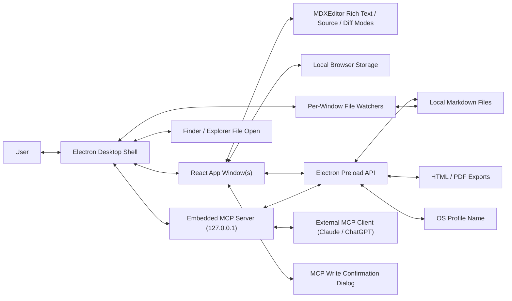

# Architecture Overview

This document serves as a living overview of the Nexus codebase. Update it as the product, file layout, and runtime boundaries evolve.

## Project Structure

- `package.json`: Project scripts, Electron package metadata, Windows and macOS icon packaging metadata, Markdown export dependency metadata, bundled Fontsource font dependencies, and runtime dependencies.
- `.github/workflows/build-desktop.yml`: GitHub Actions workflow that builds and uploads Windows and macOS desktop artifacts on `develop` pushes and manual runs.
- `electron/main.cjs`: Electron main process that creates one or more desktop browser windows, applies the local app icon, installs the File, Edit, View, Settings, and Help menus, handles file dialogs and unsaved-change prompts, forwards editor zoom menu actions, displays the current editor zoom percentage in the View menu, exports Markdown to self-contained HTML and paper-sized PDF with local image resolution, selected editor font, selected base font size, selected orientation, selected margins, and Mermaid diagram rendering, resolves local image preview paths, watches opened files for external changes, accepts OS file-open handoffs, guards close attempts per window, coordinates application quit across multiple dirty windows, exposes the OS profile name, provides Exit, owns the native editable context menu with spellcheck suggestions, hosts the optional embedded MCP server lifecycle, routes MCP read tool calls to the focused renderer, routes MCP write tool calls through the renderer confirmation dialog, and loads the built renderer.
- `electron/preload.cjs`: Safe preload bridge exposing menu action subscriptions, initial OS-opened file lookup, close-request coordination, profile-name lookup, Markdown file open/save/watch/export APIs (HTML and PDF), paper-size, orientation, and margin PDF export options, image selection and preview-resolution APIs, external file change subscriptions, the unsaved-change confirmation dialog, MCP server configure/get-state/regenerate-token requests, MCP renderer registration, MCP read/write tool dispatch from main, and MCP write-confirmation result reporting.
- `electron/mcp-server.cjs`: Embedded Model Context Protocol server. Owns the `http.Server` bound to `127.0.0.1` on the configured port, implements the Streamable HTTP transport at `POST /mcp` with JSON-RPC framing, validates the bearer token, dispatches to the read-only and write tool implementations, and exposes start/stop/reconfigure hooks used by `electron/main.cjs`. The write tool delegates to a main-process bridge that asks the target renderer to confirm before resolving.
- `index.html`: Vite application entry point.
- `src/main.tsx`: React bootstrap and bundled Fontsource font stylesheet imports for editor rendering.
- `src/App.tsx`: Primary app shell, document state, blank startup behavior, initial empty-editor focus, application title formatting, font, paragraph spacing, paper-size, paper-orientation, margin, editor zoom state, light/dark/system theme resolution, paper/plain editor view state, plain-view responsive wrapping state, MDXEditor plugin registration, image preview handling, toolbar registration, rich/source scroll-position synchronization, find-panel command routing, and diff baseline coordination.
- `src/components/about/AboutDialog.tsx`: Shadcn-styled About dialog opened from the Help menu.
- `src/components/editor/EditorContextMenu.tsx`: Browser-fallback editor context menu that exposes Cut, Copy, and Paste using local shadcn-style primitives when the app is not running inside Electron.
- `src/components/editor/FileChangedDialog.tsx`: Shadcn-styled external file change and conflict prompt.
- `src/components/editor/FindTextPanel.tsx`: Compact in-editor find panel backed by MDXEditor's search plugin, with literal text search, match counts, next/previous navigation, active-match scroll callbacks, and close behavior.
- `src/components/editor/InsertImageImport.tsx`: Shadcn-styled image import dialog and toolbar button for local file URL, remote HTTP(S), and embedded base64 image insertion.
- `src/components/editor/ListExitPlugin.ts`: Small MDXEditor/Lexical plugin that restores normal desktop list exit behavior when Enter is pressed on an empty list item.
- `src/components/editor/ShadcnMdxToolbar.tsx`: Project-owned shadcn-styled grouped toolbar composition that keeps MDXEditor's broad rich-text command set visible in unlabeled button groups, applies consistent tooltips to Nexus-owned controls, includes paper/plain, paper orientation, and plain-view responsive wrapping toggles, floats the view-control group in source and diff modes, and leaves undo, redo, refresh, zoom, and document actions in native menus.
- `src/components/ui/button-group.tsx`: Local shadcn-style button group primitive used to cluster related toolbar controls without visible group labels.
- `src/components/settings/SettingsDialog.tsx`: Shadcn-styled settings dialog for editor appearance, light/dark/system theme, unit-labeled base font size, paragraph spacing, paper-size, paper-orientation, margin preferences, and the optional MCP server enable/port/auth-mode/bearer-token section.
- `src/components/mcp/McpWriteConfirmDialog.tsx`: Shadcn-styled confirmation modal that renders the proposed Markdown alongside the current buffer when an MCP client invokes the document replace tool, with Approve and Reject actions resolving the pending tool call.
- `src/components/ui/`: Local shadcn-style UI primitives used by project-owned controls.
- `src/styles.css`: Global application styling, including light and dark app theme tokens, the toggleable paper/plain rich-text editing surface, toolbar-matched rich/source/diff editor backgrounds, edge-to-edge editor frame, sticky white shadcn-styled grouped toolbar layout with a gray bottom border, floating source/diff view controls, bordered paragraph dropdown controls, and raised transform-offset dropdown and tooltip layers.
- `src/lib/utils.ts`: Shared class name utility for shadcn-style components.
- `src/lib/markdown.ts`: Markdown utilities, default document content, local storage helpers, and line-ending-normalized dirty comparison helpers.
- `src/lib/demoDocument.ts`: Built-in Markdown feature showcase used by the File/Load Demo Document action for demos and export smoke tests.
- `src/lib/settings.ts`: Local settings utilities, default editor font, bundled web font options, base font size, paragraph spacing, light/dark/system theme preference, paper/plain view, plain-view responsive wrapping, paper-size, paper-orientation, margin configuration, MCP server enabled/port/auth-mode/bearer-token defaults and sanitizers, and OS-profile-scoped storage keys.
- `scripts/run-electron.ps1`: Windows PowerShell runner that builds the app and launches it through the local Electron dependency.
- `scripts/generate-mac-icon.mjs`: Cross-platform Node script that converts the root `nexus.png` asset into a packaged macOS `nexus.icns` bundle icon.
- `tasks/`: AI-DLC task documents.
- `PRODUCT.md`: Product scope and behavioral requirements.
- `ARCHITECTURE.md`: Architecture and implementation guidance.
- `CHANGELOG.md`: Project change history.

## High-Level System Diagram

Data flow:

1. The user edits Markdown in one or more React app windows.
2. On launch, the renderer initializes a blank untitled document with no current file path.
3. The Electron main process applies `nexus.png` to each BrowserWindow and to the macOS Dock when available.
4. The editor updates the in-memory document state.
5. File/New Window creates another BrowserWindow with its own renderer state and a blank untitled document.
6. macOS Finder `open-file` events and Windows Explorer/Open With process arguments are normalized into file paths.
7. OS-handed file paths create editor windows with pending initial file payloads.
8. The renderer asks preload for its initial opened file and loads it into that window's independent document state.
9. When startup confirms there is no initial opened file and the document is still an empty untitled buffer, the renderer focuses MDXEditor at the root start once so the user can type immediately.
10. Electron document menu actions are forwarded to the focused renderer window through preload.
11. The renderer requests open/save operations through Electron IPC, and the main process performs file dialogs and disk I/O for the window that made the request.
12. For File/New, the focused renderer compares the current editor buffer against the last saved/opened buffer using a line-ending-normalized dirty check and asks the main process to show a Save, Don't Save, or Cancel prompt before clearing dirty content.
13. For File/Open, the focused renderer first asks the main process to show the native open-file dialog; only after a file is selected does it compare the current buffer against the last saved/opened buffer using the same line-ending-normalized dirty check and ask whether to save, discard, or cancel before replacing dirty content.
14. For File/Load Demo Document, the focused renderer asks the same dirty-buffer confirmation helper before replacing the current buffer with the built-in feature showcase as a clean untitled document.
15. For File/Export as HTML and File/Export as PDF, the focused renderer sends its current Markdown buffer, current file path, selected editor font, selected base font size, and selected paragraph spacing to Electron without changing saved state. PDF export also sends the selected Letter or A4 paper size, portrait/landscape orientation, and page margins.
16. The Electron main process renders export HTML with Marked, resolves Markdown image paths with the same local path rules used by preview, converts supported admonition directives into styled callout HTML, and emits Mermaid placeholders for fenced `mermaid` code blocks. HTML export uses a self-contained path: prompt for the destination, inline supported local Markdown images as base64 data URLs, inline selected bundled Fontsource CSS and font files as base64 data URLs, load the document from a temporary file for Mermaid rendering, replace successful Mermaid placeholders with base64 SVG image data URLs, and write the static HTML file. PDF output keeps the pre-print-preview direct flow: strip leading YAML frontmatter, load the rendered HTML as a data URL, render Mermaid diagrams in that export window, wait for fonts, call Electron's PDF renderer once with selected page size, orientation, custom margins, and print backgrounds, then write the resulting bytes after a save dialog. If direct rich PDF generation fails, the export reports that error instead of writing a plain text fallback PDF.
17. Each renderer formats its own native window title from its current file path and dirty state, using the app name first and falling back to Untitled when no file path is active.
18. Window close attempts are paused per window while that renderer decides whether dirty content should be saved, discarded, or kept open.
19. Application quit requests walk through all open windows, prompting each dirty renderer before closing it; canceling any prompt stops the quit flow.
20. The renderer resolves the close request back to the main process; accepted requests close the window and canceled requests leave the window running.
21. Electron handles editable `webContents` context-menu events in the main process and opens a native menu with spelling suggestions, Add to dictionary, Cut, Copy, and Paste.
22. The native context menu calls Electron's misspelling replacement, spellchecker dictionary, and edit-command APIs directly against the focused web contents.
23. In browser-only development contexts, the renderer fallback context menu restores the current editor selection and runs standard Cut, Copy, or Paste through browser edit commands.
24. Electron Edit menu roles route undo, redo, cut, copy, and paste commands to the currently focused editor control.
25. The Edit/Find menu action opens a compact renderer find panel through the menu action bridge; the panel publishes a literal text query into MDXEditor's search plugin, displays match counts, highlights all rich-text matches, moves the focused match forward or backward, and asks the app shell to scroll the active range inside Nexus's current editor scroll container.
26. The View/Zoom In, View/Zoom Out, and View/Reset Zoom menu actions route through the same menu action bridge as renderer-local display changes; the app shell clamps zoom between 50% and 200%, scales editor CSS variables for font size, paper dimensions, margins, and paragraph spacing, publishes the current zoom percentage back to Electron for display in the Reset Zoom menu item, and leaves saved Markdown plus persisted export typography settings unchanged.
27. The Settings menu opens a renderer dialog, and the renderer stores the selected editor font, base font size, paragraph spacing, app theme, paper/plain view, plain-view responsive wrapping, paper size, paper orientation, and page margins in localStorage using a key scoped to the OS profile name returned by Electron.
28. The Help/About menu opens a renderer dialog with application copyright information.
29. When MDXEditor switches between rich text and source views, the renderer captures the current editor scroll ratio and applies it to the newly active scroll container.
30. The toolbar image import control opens a shadcn-styled dialog that either requests a local image file URL from Electron, accepts an HTTP(S) URL, or requests an Electron-read base64 data URL before publishing MDXEditor's `insertImage$` command.
31. MDXEditor's image preview handler asks Electron to resolve non-URL local image sources. Absolute paths are converted to file URLs, relative paths are resolved from the current Markdown file's folder, and HTTP(S), data, blob, and existing file URLs pass through unchanged.
32. A small root-editor Lexical command plugin handles Enter on empty list items that MDXEditor represents with empty child paragraphs, clears the empty item, and delegates to Lexical's normal list paragraph insertion behavior.
33. Runnable JavaScript code blocks are represented as fenced `js nexus-run` or `javascript nexus-run` blocks, edited through CodeMirror, and executed locally in a temporary browser worker that reports console output and errors back to the renderer.
34. Mermaid code blocks are represented as standard fenced `mermaid` blocks, rendered as non-editable SVG diagrams in rich text mode, and edited as raw Markdown in source or diff mode.
35. When a renderer has a current file path, it asks preload to watch that path; the Electron main process owns one debounced `fs.watch` watcher per captured webContents ID.
36. External file change events are sent back to the owning renderer, which prompts to reload clean buffers and shows a conflict prompt for dirty buffers.
37. File saves suppress only that same window's watcher events, so another Nexus window editing the same file still sees the change as external.
38. Manual Refresh from Edit/Refresh reads the current file through preload, reloads silently when safe, and uses the same conflict prompt when disk contents differ from dirty editor contents.
39. Dirty external-change and manual-refresh conflicts keep the changed disk contents in renderer state so Review Diff can open MDXEditor's diff mode without replacing the current editor buffer.
40. Successful saves move the prior saved Markdown into a previous-version baseline before updating the current saved baseline.
41. Reloading an externally changed file preserves the current editor Markdown as the previous-version baseline before replacing the editor with disk contents.
42. During programmatic document replacement, the renderer ignores stale MDXEditor change events from the replaced buffer so the new disk contents remain clean.
43. Edit/Compare with Previous Version asks the focused renderer to use that previous-version baseline as MDXEditor's read-only diff side.
44. When changes are pushed to `develop`, GitHub Actions installs dependencies, runs tests, checks Electron entry files, builds the renderer, packages Windows and macOS builds with electron-builder, applies `nexus.ico` to Windows executable artifacts, applies `nexus.icns` to macOS app bundles, and uploads the generated installers/archives as workflow artifacts.
45. On app launch, each renderer reads the per-profile MCP settings from localStorage (enabled flag, port, bearer token) and calls `mcp:configure` over IPC so the main process can ensure the embedded MCP server matches the persisted state for that profile. The same call fires whenever the user toggles the server, changes port, or regenerates the token from the settings dialog.
46. The Electron main process owns at most one MCP `http.Server` instance. Configure requests start the server when enabled and stop it when disabled. The server binds to `127.0.0.1` only; bind failures are reported back to the requesting renderer through the configure response so the settings dialog can display a port-in-use error.
47. Each renderer registers itself as an MCP-addressable window through preload (`mcp:register-window`) and unregisters on unload. The main process keeps a per-window MCP record (window ID, captured webContents ID, last-known file path and dirty state) and tracks which window currently has focus.
49. Incoming MCP requests are JSON-RPC over Streamable HTTP at `POST /mcp`. The server checks the configured authentication mode: when set to bearer-token it validates `Authorization: Bearer {token}` against the active token and returns 401 on mismatch, and when set to none it accepts any request that already passed the loopback-only check. After authentication, the server dispatches `initialize`, `tools/list`, and `tools/call` directly. Read tool calls (`nexus_list_windows`, `nexus_get_document`) read the latest cached renderer state held by the main-process MCP record so no renderer round trip is needed.
50. MCP write tool calls (`nexus_replace_document`) send `mcp:confirm-write` over IPC to the target renderer (focused window or specified window ID), with the proposed Markdown and a short MCP client label. The renderer opens the shadcn-styled MCP write confirmation dialog showing the current buffer alongside the proposed replacement, and replies `mcp:write-decision` with approve or reject.
51. On approve, the renderer replaces the editor buffer with the proposed Markdown (using the same programmatic-change guard as external reloads so stale `onChange` events do not mark it dirty before the dirty comparison settles) and reports success back to the MCP server, which returns a JSON-RPC result to the client. On reject, the renderer reports rejection and the MCP server returns a JSON-RPC error result.
52. Closing a window while a pending MCP write confirmation is open auto-rejects that pending call and removes the window from the MCP registry. Disabling the MCP server while requests are in flight closes the HTTP listener and rejects all pending confirmation calls.

## Technology Used

- Electron: Native desktop shell for running the web app as an application.
- Node file system APIs: Cross-platform local file watching and disk reads/writes in the Electron main process.
- React: UI component model and application state.
- Vite: Local development server and production bundling.
- Electron Builder: Desktop packaging for distributable Windows and macOS artifacts.
- TypeScript: Static typing for application code.
- MDXEditor: Visual-first Markdown editor and command/plugin provider.
- Marked: Markdown-to-HTML renderer used by native export workflows.
- shadcn-style React components: Local UI primitives for project-owned controls.
- Radix Context Menu: Accessible primitive backing the browser-only fallback editor right-click menu.
- Radix Dialog: Accessible primitive backing the shadcn-styled settings modal.
- Lucide React: UI icons.
- Vitest: Unit test runner for utility behavior.
- Node `http` and `crypto`: Embedded MCP server transport and bearer-token generation.

## Core Components

### Frontend

Name: Nexus Desktop App

Description: The main user interface for editing the current Markdown document.

Technologies: React, TypeScript, MDXEditor, Vite, CSS.

Deployment: Packaged or launched through Electron. During development, Vite serves the renderer locally.

### Backend Services

N/A. Nexus v1 is local-first and has no backend service.

#### Local Document Workflow

Name: Markdown Document Workflow

Description: Keeps the current Markdown document, blank startup state, one-shot initial empty-editor focus, built-in demo document loading, MDXEditor plugins, and project-owned toolbar configuration in one direct UI flow.

Technologies: React state, local storage, MDXEditor toolbar and feature plugins, project-owned shadcn-styled grouped toolbar layout, shadcn-style UI primitives, Electron edit commands.

Deployment: Runs independently inside each desktop app renderer window. Programmatic document loads track the outgoing and incoming Markdown briefly so stale editor `onChange` events from the outgoing buffer cannot mark the freshly loaded document dirty.

#### Spellcheck Workflow

Name: Editor Spell Checking

Description: Enables Electron's built-in spellchecker in every editor window. The main process builds the native editable context menu from Electron's `webContents` context-menu spellcheck data, adds correction choices and Add to dictionary when a misspelled word is present, and keeps Cut, Copy, and Paste in the same native menu.

Technologies: Electron `webContents` spellcheck APIs, Electron Menu, Radix Context Menu fallback, React.

Deployment: Runs in the Electron main process for desktop windows, with a renderer-only fallback menu outside Electron. Misspelling replacement and dictionary updates stay in Electron so the renderer never needs direct document text or dictionary access.

#### Demo Document Workflow

Name: Built-In Feature Demo

Description: Provides a File menu action that replaces the current editor buffer with a built-in Markdown document covering frontmatter, formatted text, lists, task lists, links, a base64 image, tables, thematic breaks, Mermaid diagrams, runnable JavaScript, standard code blocks, and admonitions. The action reuses the existing dirty-buffer confirmation flow and loads the demo as a clean untitled document.

Technologies: Electron menu action forwarding, React document state, MDXEditor-supported Markdown features.

Deployment: Runs inside each renderer window with the static demo Markdown bundled in the renderer source.

#### Multi-Window Workflow

Name: Multiple Editor Windows

Description: Allows the Electron main process to create multiple BrowserWindow instances, each with its own renderer document state, title, dirty tracking, and close guard. Menu commands that edit a document target the currently focused window, while application quit coordinates close requests across all open windows.

Technologies: Electron BrowserWindow lifecycle, focused-window menu routing, per-window close state tracking.

Deployment: Runs in the Electron main process and coordinates multiple renderer instances.

#### OS File Open Workflow

Name: Finder and Explorer Open Handoff

Description: Accepts Markdown/text file paths provided by the operating system, including macOS `open-file` events, initial process arguments, and Windows second-instance arguments. Each accepted file path opens in its own editor window through a pending initial file payload exposed by preload.

Technologies: Electron `open-file`, single-instance lock, second-instance event, process argv parsing, preload IPC.

Deployment: Runs across the Electron main process and each renderer during window startup.

#### External File Change Workflow

Name: Per-Window File Watchers

Description: Watches each opened document path from the Electron main process using debounced `fs.watch` handles keyed by a captured renderer webContents ID. The renderer starts, replaces, or stops the watcher as its current file path changes. Clean buffers can reload directly from disk, dirty buffers show a shadcn-styled conflict dialog, and missing files leave the editor buffer open. Window close cleanup uses the captured ID rather than reading from a destroyed `BrowserWindow.webContents`.

Technologies: Electron IPC, Node `fs.watch`, React state, Radix Dialog.

Deployment: Runs across the Electron main process, preload bridge, and each desktop app renderer window.

#### Manual Refresh Workflow

Name: Refresh Current File

Description: Lets the focused renderer reload its current file path from disk through Edit/Refresh. Clean buffers reload silently; dirty buffers reload silently only when the editor already matches disk content, otherwise the renderer opens the existing shadcn-styled conflict dialog before replacing local edits.

Technologies: Electron menu action forwarding, preload file read IPC, React dirty-state comparison, Radix Dialog.

Deployment: Runs in each desktop app renderer window with disk reads delegated to the Electron main process.

#### Export Workflow

Name: HTML and PDF Export

Description: Adds File menu export actions for rendered HTML and PDF copies of the current Markdown buffer. The renderer sends the active Markdown, current file path, selected editor font, selected base font size, and selected paragraph spacing through preload. PDF export also sends the selected Letter or A4 paper size, portrait/landscape orientation, and page margins. The Electron main process renders a styled HTML document with Marked, resolves Markdown image paths relative to the opened Markdown file when possible, converts supported admonition directives into callout HTML, and turns fenced Mermaid blocks into export placeholders. HTML export prompts for a destination first, embeds supported local images and bundled web font files as base64 data URLs, renders Mermaid placeholders in a hidden BrowserWindow using Mermaid's browser bundle, replaces successful diagrams with base64 SVG image data URL `` elements, and writes a self-contained static HTML file. PDF generation intentionally keeps the pre-print-preview direct path: strip leading YAML frontmatter metadata, create one hidden export window, load the rendered HTML as a data URL, render Mermaid placeholders as inline SVG in that window, wait for fonts, and call `printToPDF` once with the selected page size, orientation, custom margins, and print backgrounds. If direct rich printing fails, File/Export as PDF reports the failure and does not create a text-only fallback PDF.

Technologies: Electron menu action forwarding, preload export IPC, Marked, Mermaid browser bundle, base64 `data:` URLs, Electron `BrowserWindow.webContents.printToPDF`, Node file reads and writes.

Deployment: Runs across each renderer window and the Electron main process. Exporting does not mutate the renderer's file path, saved baseline, or dirty state.

#### Diff Review Workflow

Name: MDXEditor Diff Review

Description: Compares the active editor buffer against a renderer-managed Markdown baseline. External file conflicts can review against the changed disk contents before reload, external-change reloads preserve the pre-reload editor contents as the next previous-version baseline, and successful saves preserve the saved contents from before the most recent save. A small toolbar-scoped controller publishes MDXEditor's `viewMode$` to switch into diff mode after the baseline is prepared, and the diff side remains read-only.

Technologies: React state, MDXEditor `diffSourcePlugin`, MDXEditor Gurx `viewMode$`, Electron menu action forwarding, Radix Dialog.

Deployment: Runs inside each renderer window, with disk reads provided by the Electron main process.

#### Find Text Workflow

Name: In-Editor Text Find

Description: Lets the user open a compact find panel from Edit/Find. The panel keeps a plain-text query, escapes it before passing it to MDXEditor's regex-based search plugin, displays the current match and total count, and provides previous, next, and close controls. Search highlights use browser CSS Highlight API ranges owned by MDXEditor. When the active match changes, the panel passes that range to the app shell, which scrolls the actual rich-text/source/diff editor scroller instead of relying on MDXEditor's default search scroll container.

Technologies: Electron menu action forwarding, React state, MDXEditor `searchPlugin`, CSS Highlight API.

Deployment: Runs inside each renderer window. The native menu only forwards the find command; all query state and highlighting remain local to the renderer.

#### List Editing Workflow

Name: Empty List Item Exit

Description: Restores expected desktop editor behavior for lists. The renderer registers a root Lexical Enter command that detects collapsed selections in empty list items, including MDXEditor list items that contain an empty child paragraph, then delegates to Lexical's list paragraph insertion behavior so the user exits the list.

Technologies: MDXEditor realm plugin, Lexical command registration, Lexical list helpers.

Deployment: Runs inside the rich text editor renderer.

#### Image Import Workflow

Name: Local, Remote, and Base64 Image Import

Description: Replaces the generic MDXEditor image toolbar button with a Nexus-owned shadcn-styled dialog. Local image imports use Electron's native file picker and convert the chosen path to a `file:///` source for reliable rendering. Remote imports accept `http` or `https` URLs. Base64 imports can either read a local image through Electron and embed it as a data URL, or accept a pasted base64/data URL value.

Technologies: MDXEditor `insertImage$`, Electron IPC, Node file reads, React state, Radix Dialog.

Deployment: Runs across the toolbar renderer component and Electron preload/main process image selection handlers.

#### Image Preview Workflow

Name: Relative Local Image Preview Resolution

Description: Lets opened Markdown files preview local relative image paths without rewriting document text. The renderer supplies MDXEditor with an image preview handler that delegates path resolution to Electron. The main process returns existing URL-like sources unchanged, converts absolute local paths to `file:///` URLs, and resolves relative paths from the folder containing the currently opened Markdown file.

Technologies: MDXEditor `imagePlugin` preview handler, Electron IPC, Node `path`, Node `url`.

Deployment: Runs across the renderer app shell and Electron preload/main process image preview resolver.

#### Settings Workflow

Name: Profile-Scoped Editor Settings

Description: Opens a shadcn-styled modal from the native Settings menu, lets the user choose an editor font from system and bundled web font options, a System/Light/Dark app theme, unit-labeled base font size, paragraph spacing, Letter or A4 paper size with dimensions, portrait or landscape paper orientation, and unit-labeled per-side page margins, applies the selected theme to the app shell while System follows the desktop color scheme, applies the font, font size, and paragraph spacing to rich-text editing surfaces and HTML/PDF exports, applies the paper size, orientation, and margins to the rich-text paper view and PDF exports, and persists the choices in localStorage under a key that includes the current OS profile name. The dialog can reset the current profile back to default editor preferences. The toolbar persists the same settings store when the user toggles between paper and plain rich-text views, switches paper orientation, or turns responsive content wrapping on and off for plain view.

Technologies: React state, Radix Dialog, local storage, Electron IPC for profile-name lookup.

Deployment: Runs inside the desktop app renderer with profile metadata supplied by the main process.

#### Embedded MCP Server Workflow

Name: Optional Local MCP Server

Description: Provides an off-by-default local Model Context Protocol server so external AI clients such as Claude Desktop (via an mcp-remote bridge) or ChatGPT custom connectors can read the currently focused Markdown document and propose full-document replacements that the user reviews in a diff confirmation modal before applying. The Electron main process owns the server lifecycle: starting one `http.Server` listener on `127.0.0.1:{port}` when the renderer reports the feature enabled, validating `Authorization: Bearer` against the active per-profile token, framing JSON-RPC over Streamable HTTP, and dispatching the `initialize`, `tools/list`, and `tools/call` methods. The tool surface in v1 is `nexus_list_windows`, `nexus_get_document`, and `nexus_replace_document`. Read tools resolve from the per-window MCP state record held in main. The write tool sends a confirmation IPC to the target renderer, which opens the MCP write dialog using MDXEditor-style diff presentation, and resolves the JSON-RPC call with the user's decision. The server stops listening immediately on toggle-off, on application quit, and on port reconfiguration.

Technologies: Node `http`, Node `crypto` (random token generation), Electron IPC, React state, Radix Dialog, MDXEditor diff source plugin.

Deployment: Runs entirely on the user's machine. The HTTP listener binds to `127.0.0.1` only and authenticates clients with a static per-profile bearer token shown in the settings dialog.

#### About Workflow

Name: Help About Dialog

Description: Opens a shadcn-styled modal from the native Help/About menu and displays the application copyright text.

Technologies: React state, Radix Dialog, Electron menu action forwarding.

Deployment: Runs inside the desktop app renderer.

#### Local JavaScript Runner

Name: Local JavaScript Runner Blocks

Description: Replaces Sandpack/CodeSandbox runtime usage with a local-only console runner for fenced JavaScript code blocks carrying the `nexus-run` meta flag. The renderer registers a custom MDXEditor code block descriptor, executes snippets in temporary Web Workers, captures console output, blocks common network and nested-worker APIs, and terminates long-running code after a short timeout.

Technologies: MDXEditor code block descriptors, CodeMirror editor, browser Web Workers, React state.

Deployment: Runs entirely in the desktop app renderer process.

#### Mermaid Diagram Rendering

Name: Mermaid Diagram Blocks

Description: Adds a custom MDXEditor code block descriptor for `mermaid` fenced blocks. Rich text mode renders diagrams through Mermaid with the default light theme and strict security mode, while invalid syntax displays a compact inline error. HTML and PDF exports render the same standard Mermaid fences as static SVG diagrams. Source and diff modes remain raw Markdown editing views.

Technologies: MDXEditor code block descriptors, Mermaid, React state.

Deployment: Runs inside the desktop app renderer.

#### Editor Layout

Name: Sticky Office-Inspired Grouped Toolbar Editor Frame

Description: Uses CSS theme tokens to support light and dark app chrome while keeping document exports light, and keeps the custom shadcn-styled grouped MDXEditor rich-text toolbar at the top of an edge-to-edge editor frame while the editing region owns the remaining scrollable space. Dark mode uses neutral application surfaces, explicit editor caret and selection tokens, and toolbar icon color rules that force SVG strokes/fills to inherit accessible button colors. Rich-text mode can center the editable Markdown body on a toolbar-matched paper-view background with a paper sheet sized from profile settings, selected portrait/landscape orientation, user-adjustable base font size, user-adjustable margins, and constrained media/table/code content, or switch to a plain words-first flow without the sheet, shadow, fixed page width, fixed height, or page margins. Source and diff modes set the MDXEditor wrapper, CodeMirror editor, scroller, and gutters to the same toolbar background so no separate editor layer remains visible. Plain view can either wrap content responsively to the full application width or use a centered readable column; all editor modes keep content wrapping within the viewport instead of adding page-level horizontal scrolling. Renderer-local editor zoom scales the display variables used by rich-text paper sizing, page margins, paragraph spacing, and source/diff text size without mutating saved settings. The toolbar keeps rich-text command groups visible together in unlabeled button groups, draws a subtle bottom border using the same line token as the toolbar group borders, exposes paper view, paper orientation, responsive wrapping, and editor mode controls in the view group, floats the view mode group to the right in rich text mode, and switches the view-control group to an absolute top-right overlay in source and diff modes so those modes do not reserve toolbar height. The toolbar applies bordered paragraph dropdown controls and keeps toolbar dropdown, select, tooltip, and popover surfaces layered above and transform-offset below the sticky toolbar. On Windows, the renderer adds a platform-specific shell class so the toolbar can draw a subtle top separator beneath the native menu. The app shell observes MDXEditor's active rich/source scroll container and keeps the scroll ratio synchronized when switching editor views.

Technologies: CSS flex layout, sticky positioning, project-owned shadcn-styled grouped toolbar layout, MDXEditor class hooks, DOM scroll observers.

Deployment: Runs inside the desktop app renderer.

## Data Stores

### Browser Local Storage

Name: Nexus Draft Storage

Type: Browser local storage.

Purpose: Stores transient draft state as a convenience, and stores profile-scoped editor settings such as font, base font size, paragraph spacing, app theme, paper/plain view, plain-view responsive wrapping, paper-size, paper-orientation, and margin preferences.

Key Schemas/Collections: `nexus:draft:v1`, `nexus:settings:v1:{profileName}` (now includes nested MCP server enabled/port/bearer-token fields).

### File System

Name: User Markdown Files

Type: Local files selected through Electron dialogs.

Purpose: Stores documents opened and saved through the native File menu.

Key Schemas/Collections: `.md`, `.markdown`, `.mdx`, and `.txt` files.

## External Integrations / APIs

N/A. Nexus v1 does not call external services.

## Deployment & Infrastructure

Cloud Provider: N/A. Local desktop application.

Key Services Used: Electron runtime.

CI/CD Pipeline: GitHub Actions runs `.github/workflows/build-desktop.yml` on pushes to `develop` and on manual dispatch. The workflow uses a Windows runner for x64 NSIS/portable executables with `nexus.ico` as the packaged Windows icon and a macOS runner for DMG/ZIP artifacts with `nexus.icns` as the packaged macOS bundle icon, with signing identity auto-discovery disabled for unsigned local-first builds.

Monitoring & Logging: Browser developer tools during development.

## Security Considerations

Authentication: N/A for v1.

Authorization: N/A for v1.

Data Encryption: N/A for v1 local storage; users should avoid treating local browser storage as encrypted.

Key Security Tools/Practices:

- Keep document content local by default.
- Keep the embedded MCP server off by default so document content does not leave the app unless the user explicitly opts in.
- Bind the embedded MCP HTTP listener to `127.0.0.1` only and require a per-profile bearer token on every request by default; treat the optional no-auth mode as an explicit user opt-in for trusted single-user environments and surface a visible warning in the settings dialog when it is selected.
- Require an in-app diff confirmation modal before any MCP write tool can modify the document, so even an authenticated client cannot silently change content.
- Do not send content to first-party remote AI services in v1.
- Prefer explicit user actions for open and save.
- Use Electron built-in menu roles and webContents edit commands for standard Edit behavior instead of exposing clipboard contents to the renderer.
- Use Electron built-in spellcheck APIs and native context-menu data for misspelling replacement and dictionary updates instead of exposing document text to custom spellcheck code.
- Keep Node integration disabled in the renderer and expose file actions through preload IPC only.
- Keep unused vendored browser framework code out of the repository and public asset tree.

## Development & Testing Environment

Local Setup Instructions:

1. Run `npm install`.
2. Run `npm run dev` for the Vite development server.
3. Run `npm run build` to create a production bundle before packaging.
4. Run `npm run dist:win` on Windows to package Windows installers into `release/`.
5. Run `npm run dist:mac` on macOS to package macOS artifacts into `release/`.
6. Run `powershell -ExecutionPolicy Bypass -File scripts/run-electron.ps1` to build and launch with Electron.
7. Run `powershell -ExecutionPolicy Bypass -File scripts/run-electron.ps1 -SkipBuild` to launch the existing build.

Testing Frameworks: Vitest for utility tests.

Code Quality Tools: TypeScript compiler.

## Future Considerations / Roadmap

- Add real AI provider integrations behind explicit settings and privacy warnings.
- Add changed-lines review and accept/reject controls for individual changed blocks.
- Add Git-aware diff support for repository-backed Markdown files.
- Add platform-specific signing and notarization once release credentials are available.
- Expand the MCP tool surface (patch/find-replace tools, save/save-as tools, image-aware writes) once the read+replace baseline is in use.
- Add a stdio MCP transport via a separate launcher binary for clients that do not yet support HTTP/Streamable transport.
- Add an in-app MCP activity log so the user can review recent tool calls and their decisions.

## Glossary / Acronyms

AI: Artificial Intelligence.

AI-DLC: AI Development Lifecycle.

MCP: Model Context Protocol — JSON-RPC based protocol for connecting AI applications to external tools and data sources.

MDX: Markdown with JSX.

Electron: Desktop application runtime that combines Chromium and Node.js.
